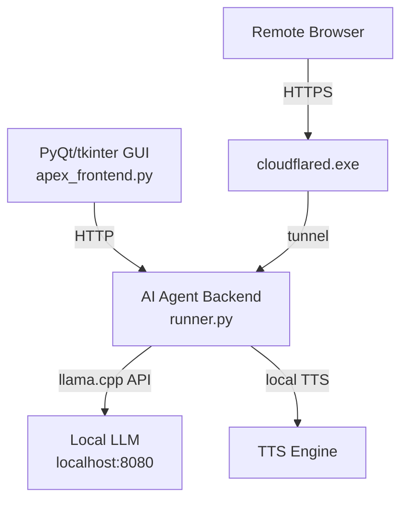

# APEX Automation Bot — Desktop AI Agent

> **Project path:** `e:\Ai\automation_bot`
> **Stack:** Python · PyQt / tkinter · Cloudflare Tunnel (`cloudflared.exe`) · Nuitka (compiled to `.exe`)
> **Type:** Windows desktop app — AI assistant with local TTS, local LLM, Cloudflare tunnel exposure
> **Last major activity:** February 2026

---

## 1. Executive Technical Summary

APEX Automation Bot is a Windows desktop AI agent application compiled to a standalone executable via Nuitka (`guardian.exe`). It provides a local AI assistant with TTS capabilities, exposed externally via Cloudflare Tunnel for remote access. The project includes an Inno Setup installer (`installer.iss`) for distribution.

**Core purpose:** Local AI chat + automation assistant accessible both locally (desktop GUI) and remotely (via Cloudflare tunnel). Acts as an "always-on" AI agent on the user's Windows machine.

**Why a compiled executable:** Eliminates Python runtime dependency for end-users. Nuitka compiles Python to native C code → smaller deployment, faster startup, no Python installation required.

---

## 2. System Architecture



### 2.1 Components

**`runner.py`:** Main agent backend. Handles AI conversation loop.

**`apex_frontend.py`:** Desktop GUI. PyQt or tkinter interface for local interaction.

**`cloudflared/`:** Cloudflare Tunnel binary + `config.yml`. Exposes local agent to internet with a Cloudflare-issued HTTPS URL — no port forwarding or static IP required.

**Nuitka Build:** `dist/guardian.exe` (onefile build). Compiled from Python source. `build_definitions.h` and C compilation artifacts indicate Nuitka compilation pipeline.

**Installer:** `installer.iss` (Inno Setup). Packages `guardian.exe` + dependencies into a Windows installer. Designed for non-technical user distribution.

### 2.2 Architecture Directories

```
src/
├── autonomy/       # Agent autonomous behavior
├── bot_data/       # Conversation data storage
├── integrity/      # Data integrity checks
├── memory/         # Conversation memory
├── migrations/     # DB schema migrations
├── models/         # Data models
├── monitoring/     # Health monitoring
├── observability/  # Telemetry
├── ownership/      # Resource ownership tracking
├── performance/    # Performance profiling
└── hardware_intelligence.py  # GPU/CPU detection
```

The depth of this directory structure (autonomy, integrity, observability, ownership) suggests significant infrastructure investment for what appears to be a local agent — more mature than a typical chatbot.

### 2.3 Cloudflare Tunnel Strategy

`cloudflared/config.yml` configures the tunnel. This provides:
- HTTPS endpoint without SSL certificate management
- No firewall rule changes needed
- Cloudflare DDoS protection
- Works behind NAT/CGNAT (common in Indian ISPs)

The tunnel approach is architecturally sound for consumer internet scenarios where static IPs and port forwarding are unavailable or unreliable.

---

## 3. Engineering Assessment

**Strengths:**
- Nuitka compilation for zero-dependency distribution is production-grade
- Cloudflare Tunnel for external access is elegant for consumer internet
- Inno Setup installer demonstrates deployment thinking beyond "run the Python script"
- Rich directory structure suggests comprehensive observability/autonomy planning

**Weaknesses:**
- No code signing → Windows SmartScreen blocks installation on new systems
- Cloudflare Tunnel config is static — domain rotation requires manual config change
- Local LLM dependency (llama.cpp) must be separately managed — not bundled in installer
- Debug artifacts (print statements as filenames: `print(OS`, `python`, `from`) suggest a Nuitka build gone wrong that left broken files in the directory

**Critical observation:** The presence of files named `print(OS`, `from`, `import`, `python`, `EOF` in the root directory indicates a Python script was accidentally executed as a shell command during development, creating files from misinterpreted print statements. This is a development environment artifact, not production code.

**Operational maturity:** Medium. The deployment packaging (Nuitka + Inno Setup + Cloudflare) is sophisticated. The development environment hygiene (stray files) indicates rapid iteration without cleanup discipline.

---

## 4. Relationship to Broader Ecosystem

The automation bot predates APEX Voice AI and appears to be an earlier iteration of the same core concept: local AI agent accessible remotely. APEX Voice AI evolved this concept into a multi-tenant cloud telephony platform, while the automation bot represents the single-user desktop approach.

Key shared patterns:
- Local LLM via llama.cpp
- Cloudflare/ngrok for remote exposure
- TTS integration
- Conversation memory

---

## 5. Future Evolution Path

1. **Code signing:** Purchase code signing certificate (Sectigo/DigiCert). Eliminate SmartScreen warnings for distribution.
2. **Bundle llama.cpp:** Include a curated llama.cpp build in the installer. Eliminate manual LLM setup step.
3. **Auto-update:** Cloudflare tunnel domain is stable — use it to deliver update checks and patch delivery.
4. **Merge with APEX Voice AI local mode:** The `APEX_MODE=local` VoiceAgent in aivoice is essentially the same concept. Consolidate into unified local agent with optional Twilio/cloud integration.
