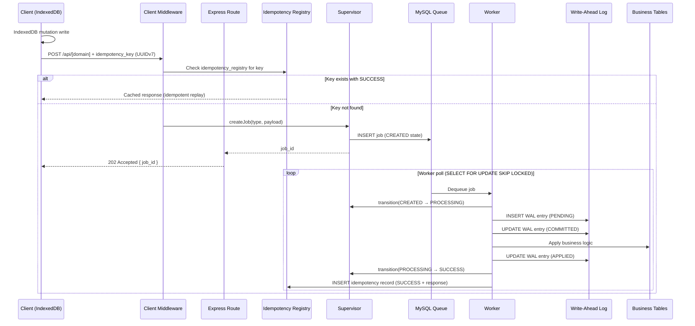
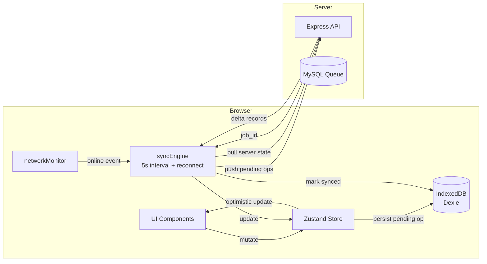
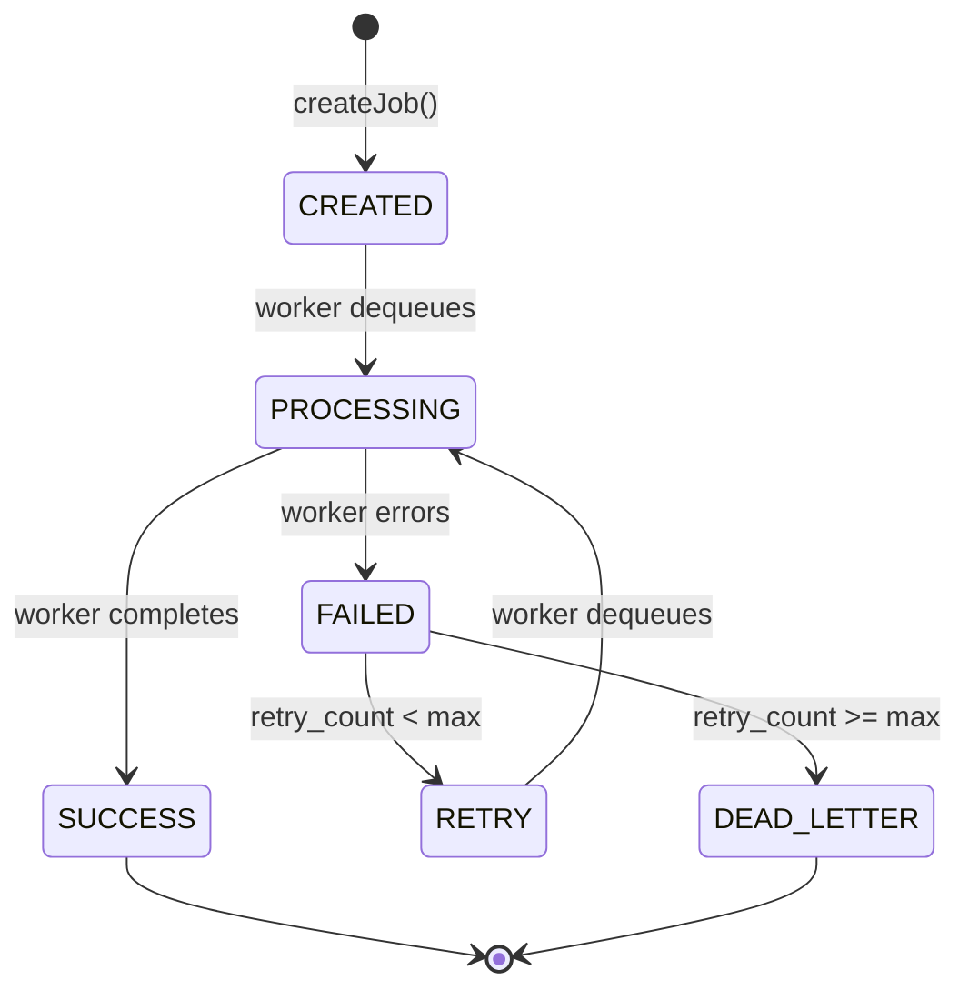

# APEX Hospital Management System (APEX-HMS)

> **Project path:** `e:\Projects\HMS\APEX-HMS`
> **Stack:** TypeScript · Node.js · Express · MySQL 8.0 · Vite/React · npm Workspaces monorepo
> **Architecture:** Offline-first PWA · WAL-based mutation pipeline · Multi-tenant RBAC
> **Last major activity:** April 2026

---

## 1. Executive Technical Summary

APEX-HMS is a production hospital management system designed for small-to-mid Indian hospitals operating with intermittent internet connectivity. It manages patient registration, OPD (outpatient), IPD (inpatient), laboratory, pharmacy, billing, insurance, and emergency workflows across a multi-tenant architecture.

**Core operational purpose:** Replace paper-based hospital workflows in resource-constrained environments. The offline-first design means nurses and doctors can continue working during internet outages; data syncs automatically when connectivity restores.

**Why the architecture exists:** Indian tier-2 city hospitals face 1-6 hour daily power outages and unreliable internet. Traditional web apps fail during outages — APEX-HMS does not. The WAL + offline-first + IndexedDB stack ensures zero data loss even during simultaneous server crash and internet failure.

**Core constraints solved:**
- Complete offline operation with automatic sync on reconnect
- Idempotent mutation pipeline prevents duplicate records during network flaps
- WAL-based crash recovery ensures no committed operation is ever lost
- RBAC prevents unauthorized access to PHI across multiple hospital tenants
- Write-ahead log enables audit compliance for Indian hospital regulations

---

## 2. System Architecture

### 2.1 Full-Stack Monorepo Structure

```
APEX-HMS/
├── packages/
│   ├── shared/          # @apex-hms/shared: types, Zod validators, constants
│   │   └── src/
│   │       ├── types/   # JobType, JobState, JWTPayload
│   │       ├── schemas/ # Zod validators shared across client + server
│   │       └── constants/ # JOB_STATES, ERROR_CODES, isValidTransition()
│   ├── server/          # Express API + background workers
│   │   └── src/
│   │       ├── supervisor/     # Job state machine authority
│   │       ├── queue/          # MySQL FIFO queue (SELECT FOR UPDATE SKIP LOCKED)
│   │       ├── worker/         # Job processor + handler-registry
│   │       ├── wal/            # Write-ahead log (PENDING→COMMITTED→APPLIED)
│   │       ├── middleware/     # auth→tenant→rbac→idempotency chain
│   │       ├── audit/          # Append-only audit log
│   │       └── [domain]/       # opd, ipd, lab, pharmacy, billing, insurance, emergency, patient
│   └── client/          # React/Vite PWA
│       └── src/
│           ├── store/   # Zustand stores (patientStore, opdStore, syncStore)
│           ├── modules/ # Domain UI modules
│           ├── offline/ # IndexedDB (Dexie), syncEngine, networkMonitor
│           └── services/api.ts  # axios + idempotency_key
└── docker-compose.yml   # MySQL + server + nginx
```

### 2.2 Critical Mutation Pipeline

**LAW 1 (enforced by design):** No component writes directly to business tables. Only WAL writes occur from routes. Workers apply WAL entries to business tables.



### 2.3 Offline Sync Architecture



The sync engine runs every 5 seconds and on every network reconnect event. Offline operations are queued in IndexedDB with a `pending` status and a client-generated UUIDv7 idempotency key. On sync, the key travels to the server where it prevents duplicate processing.

### 2.4 WAL State Machine

```
INSERT: status=PENDING
Worker picks up job:
  UPDATE: status=COMMITTED  (durable: the operation will happen)
Worker executes business table write:
  UPDATE: status=APPLIED    (done)

Recovery scan on startup:
  COMMITTED but not APPLIED → replay (server crashed between commit and apply)
  PENDING → discard (server crashed before commit, client will retry)
```

`innodb_flush_log_at_trx_commit=1` is required. Without it, COMMITTED entries can be lost on MySQL crash, breaking the recovery guarantee.

### 2.5 Supervisor State Machine



Transitions use optimistic concurrency: `UPDATE jobs SET status='PROCESSING' WHERE job_id=? AND status='CREATED'`. If 0 rows affected → `ConcurrentTransitionError` (another worker won the race). This eliminates distributed lock overhead.

---

## 3. Core Infrastructure Components

### 3.1 MySQL Queue with SKIP LOCKED

```sql
SELECT * FROM job_queue
WHERE status = 'CREATED'
ORDER BY priority DESC, created_at ASC
LIMIT 1
FOR UPDATE SKIP LOCKED;
```

`SKIP LOCKED` enables multiple workers to poll simultaneously without contention. Each worker skips rows already locked by other workers. No Redis required for the queue — MySQL handles durability and atomicity natively.

This pattern works correctly because:
1. MySQL row-level locking (InnoDB) is granular
2. `SKIP LOCKED` ignores locked rows rather than blocking
3. The transaction is short (SELECT + UPDATE status)
4. Multiple workers scale horizontally by default

### 3.2 RBAC Middleware Chain

```
auth.middleware (JWT decode → req.user)
    ↓
tenant.middleware (inject req.user.tenantId, verify tenant access)
    ↓
rbac.middleware (check permission for route + resource)
    ↓
idempotency.middleware (check/set idempotency_registry)
    ↓
Route handler (enqueue job only — no direct business table access)
```

Every table has `tenant_id`. Tenant middleware scopes all queries automatically. RBAC middleware uses a permissions matrix defined per-role (Admin, Doctor, Nurse, Receptionist, Pharmacist, Lab Technician, Billing).

### 3.3 Domain Handler Registry

Worker dispatches to domain handlers via `handler-registry.ts`:

```typescript
const handlers: Record<JobType, JobHandler> = {
  'patient.register': patientHandlers.register,
  'opd.create_consultation': opdHandlers.createConsultation,
  'ipd.admit': ipdHandlers.admit,
  'lab.create_order': labHandlers.createOrder,
  'pharmacy.dispense': pharmacyHandlers.dispense,
  'billing.generate_invoice': billingHandlers.generateInvoice,
  'insurance.submit_claim': insuranceHandlers.submitClaim,
  'emergency.triage': emergencyHandlers.triage,
  // ... 40+ job types
};
```

All handlers follow the same contract: receive job payload + WAL writer → execute → return result. No handler directly imports DB connection — goes through WAL abstraction.

### 3.4 Audit Log

Append-only audit table. Written by workers on every mutation. Fields: `tenant_id`, `actor_id`, `action`, `resource_type`, `resource_id`, `old_value` (JSON), `new_value` (JSON), `timestamp`, `ip_address`. Soft deletes only — hard deletes require SuperAdmin role + explicit audit entry.

---

## 4. Reliability Engineering

### 4.1 Crash Recovery

Startup recovery scan:
1. Find all WAL entries in `COMMITTED` state
2. For each: re-apply business table write (idempotent by design)
3. Mark as `APPLIED`

Idempotency of business writes: all domain handlers check if the operation already exists before inserting. UUID-based primary keys from client side.

### 4.2 Idempotency Registry

Every mutating request from the client carries a UUIDv7 idempotency key. The registry:
- On first request: `INSERT idempotency_registry (key, status='IN_PROGRESS')`
- On completion: `UPDATE status='SUCCESS', response=cached_response`
- On subsequent request with same key: return cached_response immediately

UUIDv7 is time-ordered — provides natural deduplication window (UUIDs expire conceptually after ~24h by application convention).

### 4.3 Offline Queue Durability

IndexedDB is ACID-compliant within the browser. Pending operations survive:
- Browser refresh
- Browser crash
- Tab close and reopen
- OS restart (IndexedDB data survives)

Lost only if: user explicitly clears browser data, or browser storage quota is exceeded (handled by syncEngine's storage monitoring).

### 4.4 Service Worker (PWA)

Workbox service worker (`sw.js`, `workbox-*.js` in dist). Provides:
- Static asset caching (app shell offline-capable)
- Background sync for pending mutations (additional safety net)
- Cache invalidation on version update

---

## 5. Performance Engineering

### 5.1 Read Performance

Reads bypass the job queue entirely. Domain GET routes query MySQL directly with tenant scoping. No WAL overhead on reads. Indexed columns: `tenant_id`, `patient_id`, `created_at`, status fields.

### 5.2 Write Throughput

Bottleneck: MySQL queue + WAL insert latency (~5-10ms per job on SSD). At 10 concurrent users submitting mutations:
- Queue insert: 10ms
- Worker poll: <5ms (SKIP LOCKED)
- WAL write: 2× 5ms
- Business table write: 5-20ms (complexity dependent)

Total mutation latency per operation: ~25-50ms server-side, plus network + client sync lag.

### 5.3 Multi-Worker Scaling

Multiple worker processes can run against the same MySQL queue via SKIP LOCKED. Each worker is stateless — no shared memory beyond DB. Linear throughput scaling up to MySQL connection pool limit.

---

## 6. Operational Constraints

### 6.1 Offline-First Reality

The system is designed for environments where internet cuts out for hours. All UI mutations write to IndexedDB first. The user experience is seamless during outage — operations queue locally and sync automatically on reconnect.

Limitation: two offline users editing the same record create a conflict on sync. Current behavior: last-write-wins at the server (the second sync overwrites the first). No CRDT or conflict resolution UI. Acceptable for most hospital workflows (records are append-heavy, not concurrent-edit-heavy).

### 6.2 MySQL 8.0 Requirement

`SELECT FOR UPDATE SKIP LOCKED` was added in MySQL 8.0.1. `innodb_flush_log_at_trx_commit=1` is a MySQL 5.7+ configuration. The system does not support MariaDB (different SKIP LOCKED behavior).

### 6.3 PHI Sensitivity

All patient data is PHI under Indian DPDP Act 2023. Architecture ensures:
- Tenant isolation at DB level (row-level `tenant_id`)
- No PHI in logs (audit log stores operation metadata, not raw PHI values in most paths)
- JWT expiry enforces session termination
- Soft deletes only — accidental deletion is recoverable

---

## 7. Testing

### 7.1 Unit Tests

`~290/291 tests pass`. Located in `src/__tests__/unit/`. Vitest, no live DB required. Tests cover:
- Supervisor state machine transitions (including ConcurrentTransitionError)
- WAL write/read/recovery cycle (mock DB)
- Idempotency registry check/set/replay
- RBAC permission matrix
- Zod schema validation for all job payloads

### 7.2 Integration Tests

`src/__tests__/integration/` — require live server. Tests full mutation pipeline from route → queue → worker → WAL → business tables.

### 7.3 Load Tests

k6 scripts in `scripts/k6/baseline.js`. Simulates concurrent users (registration, OPD consultation, billing) with idempotency keys. Validates throughput, response time, and error rate under load.

---

## 8. Security & Isolation

### 8.1 Tenant Isolation Enforcement

Tenant middleware is **not optional** — it's in the middleware chain before every domain route. Every SQL query goes through a tenant-scoped query builder that appends `WHERE tenant_id = ?` automatically. Direct SQL without tenant scope is a code review violation.

### 8.2 JWT Authentication

JWTs signed with HS256, expiry enforced server-side. `JWTPayload` type from `@apex-hms/shared` includes `tenantId`, `role`, `userId`. Middleware rejects expired or tampered tokens with 401.

### 8.3 RBAC Granularity

Roles: `SUPER_ADMIN`, `ADMIN`, `DOCTOR`, `NURSE`, `RECEPTIONIST`, `PHARMACIST`, `LAB_TECH`, `BILLING`. Each route has a required permission. Middleware checks `rbac_matrix[role][resource][action]`. Principle of least privilege — no role has default-deny-with-exceptions; all access is default-deny.

---

## 9. Engineering Assessment

**Strengths:**
- WAL-first mutation pipeline is architecturally sound — correct crash recovery semantics
- SKIP LOCKED queue is elegant and database-native (no Redis dependency for core workflow)
- Offline-first with IndexedDB is genuinely production-grade for the target environment
- Monorepo type sharing via `@apex-hms/shared` eliminates client/server schema drift
- ~290/291 unit test pass rate indicates reliable core logic
- Soft-delete-only design is correct for PHI compliance

**Weaknesses:**
- WAL apply is not atomic with business table write (between COMMITTED and APPLIED, a crash still needs replay logic — this is correct but complex)
- Conflict resolution on offline sync is last-write-wins — insufficient for concurrent edits to the same patient record
- No distributed tracing — debugging cross-service issues requires log correlation
- Docker Compose but no Kubernetes manifests — production deployment requires additional ops work
- No database connection pooling configuration visible — risk of connection exhaustion under load

**Architectural maturity:** High. The WAL + offline-first + SKIP LOCKED combination is a genuinely sophisticated approach to the reliability problem. Few open-source HMS projects implement this level of durability.

**Technical debt:** Low for core pipeline. Some debt in conflict resolution (last-write-wins) and observability (no metrics export).

---

## 10. Future Evolution Path

### v2 Architecture

1. **Conflict resolution:** Implement operational transform (OT) or last-write-wins with version vectors. For appointment bookings, enforce server-authoritative slot locking.

2. **Real-time push:** Replace 5-second sync poll with WebSocket/SSE push from server. Reduces sync latency from 5s to <100ms.

3. **WAL → Event Store:** Evolve WAL into an append-only event store (Event Sourcing). Each APPLIED entry becomes a domain event. Enables audit log, reporting, and CQRS read models as first-class citizens.

4. **Kubernetes:** Replace Docker Compose with Helm chart. HPA on worker deployment. PodDisruptionBudget on API. MySQL → managed RDS/CloudSQL.

5. **Observability:** OpenTelemetry instrumentation on all domain handlers. Trace mutation end-to-end: HTTP request → queue → worker → WAL → response. Grafana dashboard on queue depth, WAL lag, worker throughput.

6. **PHI encryption at rest:** Encrypt PHI fields (name, phone, diagnosis) at application layer before DB write. Key per tenant stored in KMS. Tenant compromise cannot read other tenant data even with DB access.
