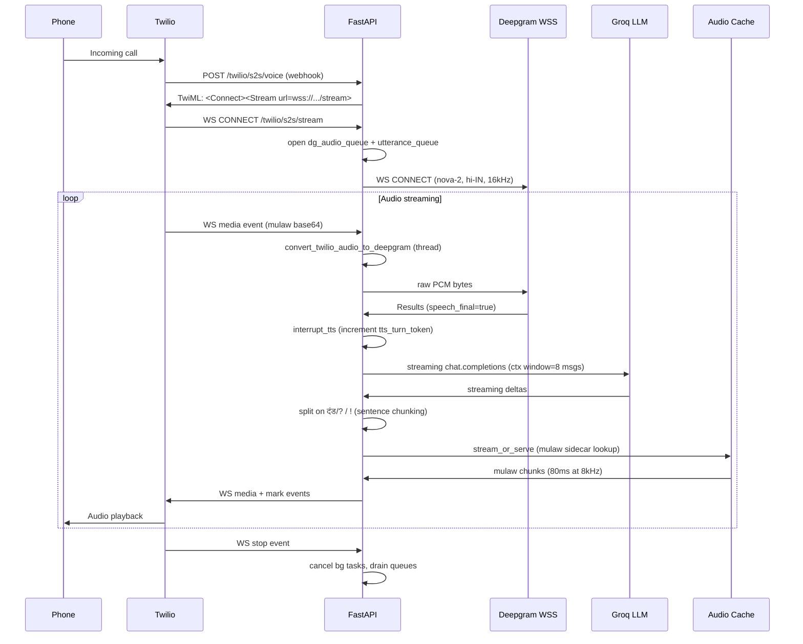
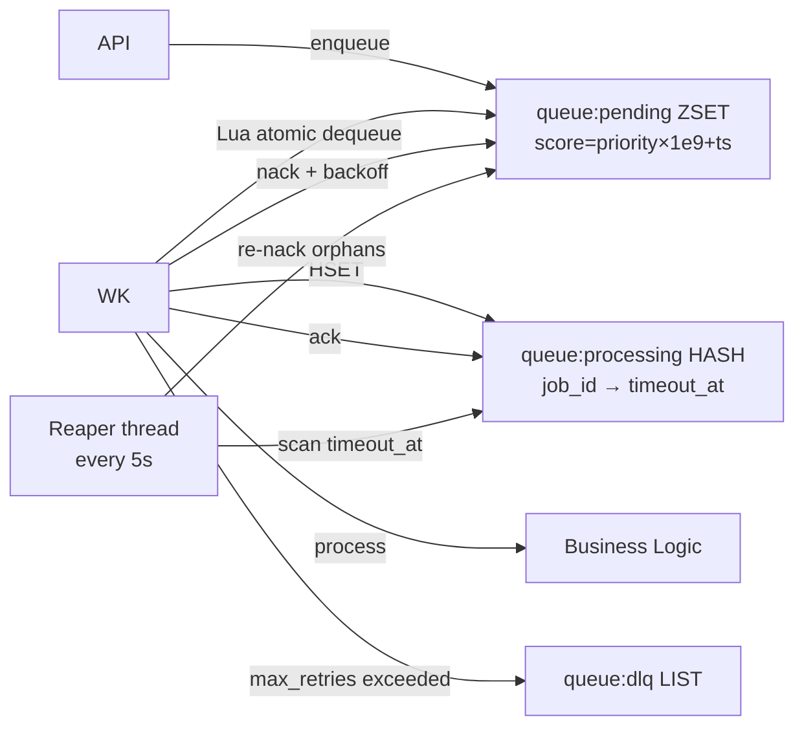

# APEX Voice AI Platform

> **Project path:** `e:\Projects\aivoice`
> **Stack:** Python 3.10/3.14 · FastAPI · Uvicorn · Redis 7.2 · Docker Compose
> **Primary mode:** `APEX_MODE=twilio` (production); `APEX_MODE=local` (microphone agent)
> **Last major activity:** May 2026

---

## 1. Executive Technical Summary

APEX Voice AI is a production multi-tenant voice AI platform that handles inbound and outbound telephone calls through Twilio and Telnyx, plus WhatsApp through WAHA. It implements a complete real-time speech pipeline: Deepgram STT → Groq LLM → Azure/Edge TTS, all over a live WebSocket stream. The system is designed to run on a single consumer-grade server exposed via ngrok/Cloudflare, serving multiple business tenants (clinics, hospitals, call centers) simultaneously.

**Core operational purpose:** Allow businesses to deploy a branded AI voice agent that answers calls, books appointments, and runs outbound marketing campaigns — without cloud VM infrastructure. The entire stack runs from one `docker-compose up`.

**Why the architecture exists:** The constraint is consumer hardware (no managed Kubernetes, no load balancer), intermittent internet (ngrok tunnels break), and multi-tenant operation with strict cost ceilings (Groq rate limits, Twilio per-minute billing). Every architectural decision traces back to these three constraints.

**Key problems solved:**
- Sub-200ms TTS latency via disk-backed mulaw sidecar cache
- Groq rate-limit starvation via AIMD concurrency throttle + per-tenant semaphores
- Twilio webhook retry idempotency via Redis NX session creation
- Provider outage isolation via named circuit breakers (Groq, TTS, Deepgram, Twilio, Telnyx, WAHA)
- Session continuity across server restarts via Redis-persisted conversation snapshots

---

## 2. System Architecture

### 2.1 Service Topology

```mermaid
graph TB
    subgraph External
        TW[Twilio Cloud]
        TEL[Telnyx Cloud]
        DG[Deepgram STT]
        GR[Groq LLM API]
        AZ[Azure TTS / Edge TTS]
        FB[Firebase Auth]
        WA[WhatsApp / WAHA Container]
    end

    subgraph Docker Compose
        NG[nginx reverse-proxy]
        API[FastAPI :5050<br/>api service]
        WK[Worker<br/>worker service]
        SV[Supervisor<br/>supervisor service]
        RD[(Redis 7.2<br/>:6379)]
        WH[WAHA :3000<br/>WhatsApp bridge]
        NK[ngrok :4040<br/>dev profile]
    end

    subgraph Storage
        ST[/app/static<br/>TTS audio cache]
        DA[/app/data<br/>sessions + call records]
        TN[/app/tenants<br/>tenant config JSON]
        WAL[queue_wal.jsonl<br/>write-ahead log]
    end

    TW -->|HTTPS webhook| NG
    TEL -->|HTTPS webhook| NG
    NG -->|proxy| API
    API <-->|WebSocket| TW
    API <-->|WebSocket| TEL
    API -->|WebSocket| DG
    API -->|HTTP| GR
    API -->|HTTP| AZ
    API <-->|HTTP| WH
    WH <-->|WhatsApp Protocol| WA
    API <-->|pub/sub + session| RD
    WK <-->|job dequeue| RD
    SV -->|docker.sock| Docker
    SV -->|health poll| API
    API --> ST
    API --> DA
    API --> TN
    WK --> WAL
```

### 2.2 Real-Time S2S WebSocket Flow

The S2S (speech-to-speech) path is the system's hot path. Every inbound call triggers this flow:



### 2.3 Job Queue Architecture (Worker Path)

Marketing campaigns and broadcast calls use the async worker queue:



The Lua script dequeues atomically: `ZRANGEBYSCORE + ZREM + HSET` in one round-trip — no distributed lock required, no TOCTOU race.

### 2.4 Tenant Routing

Each Twilio `To` number maps to a tenant config JSON in `/app/tenants/`. Routing resolves at WebSocket `start` event via `get_tenant_for_call(to_number)`. Each tenant carries:
- `system_prompt`, `greeting`, `voice` (Azure/Edge voice name)
- `stt_corrections` dict (phonetic substitution for domain terms)
- `faq_prewarm` list (pre-generate audio at startup)
- `mode`: `"default"` | `"appointment"` (activates doctor list + booking tool calls)
- `plan`: rate-limit tier

---

## 3. Core Infrastructure Components

### 3.1 FastAPI Application Structure

```
main.py                    # APEX_MODE switch: uvicorn server vs local VoiceAgent
app/
  api/
    twilio.py              # Standard TTS gather-poll call flow
    twilio_s2s.py          # Real-time bidirectional media stream (hot path)
    telnyx_s2s.py          # Telnyx equivalent of twilio_s2s
    twilio_marketing.py    # Outbound campaign calls via queue
    telnyx_marketing.py    # Telnyx marketing
    unified_call.py        # Provider-agnostic call initiation
    waha_module/           # WhatsApp message handling
    health.py              # /healthz, /metrics
    dashboard.py           # Call history, analytics
    admin.py               # Tenant management, DLQ inspection
    appointments.py        # Appointment booking API
    white_label.py         # Per-tenant webhook customization
    middleware.py          # APIKeyMiddleware + TraceMiddleware
  core/
    circuit_breaker.py     # Named breakers: groq/tts/deepgram/twilio/telnyx/waha
    llm_throttle.py        # AIMD global + per-tenant semaphores
    config.py              # lru_cache(1) Settings from env
    idempotency.py         # Redis-backed idempotency guard
    metrics.py             # In-process counters for /metrics
    shutdown.py            # Graceful drain on SIGTERM
    logging.py             # Structured JSON log_event()
    trace.py               # Per-request trace_id propagation
  services/
    orchestrator.py        # SessionManager + Redis session persistence
    audio_cache.py         # Disk-backed TTS cache + mulaw sidecar
    llm_cache.py           # Exact-match LLM response cache (Redis)
    llm_service.py         # ConversationBrain (Groq client wrapper)
    llm_throttle.py        # (aliased to core/llm_throttle)
    call_store.py          # Active call registry + turn history
    tenant_service.py      # Tenant config loader
    rate_limiter.py        # Per-tenant call rate limits
    tts_service.py         # TTS orchestration (Azure primary, edge fallback)
    voice_agent_service.py # Local microphone VoiceAgent (non-server mode)
  infra/
    redis_queue.py         # RedisQueue (drop-in for InMemoryQueue)
    tunnel.py              # ngrok/Cloudflare tunnel management
  queue/
    job_queue.py           # get_queue() factory: in-memory or Redis
    job.py                 # Job dataclass + JobStatus enum
```

### 3.2 Redis Usage Patterns

| Key Pattern | Structure | Purpose |
|---|---|---|
| `apex:queue:pending` | ZSET (score=priority×1e9+ts) | Job priority queue |
| `apex:queue:job:{id}` | HASH | Job fields + payload |
| `apex:queue:processing` | HASH (job_id→timeout_at) | In-flight tracking |
| `apex:queue:dlq` | LIST | Dead-letter queue |
| `session:{call_sid}` | STRING (JSON, TTL=3600s) | Conversation history |
| `rate:{tenant_id}` | STRING (counter) | Per-tenant call counter |
| `idem:{op}:{key}` | HASH (NX) | Idempotency registry |
| `llm_cache:{tenant}:{hash}` | STRING (JSON) | LLM response cache |
| `asha:mem:{uuid}` | HASH+VECTOR | Vector memory (local agent) |

Redis config (docker-compose): `maxmemory 256mb`, `maxmemory-policy volatile-lru`, `appendonly yes`, `appendfsync everysec`. This provides soft durability: AOF survives crashes but can lose ~1s of writes.

### 3.3 Audio Cache Architecture

The audio cache is the most latency-critical component. Two-level structure:

**Level 1 — In-memory dict:** `"{tenant_id}:{sha256[:16]}"` → absolute filepath. Bootstrapped from disk at startup for each tenant. O(1) lookup after warm.

**Level 2 — Disk:** `static/tts_cache/{tenant_id}/{hash}.mp3` + `.ulaw` sidecar.

The `.ulaw` sidecar is the key optimization: on cache HIT, `stream_or_serve()` reads the precomputed mulaw bytes directly, skipping pydub MP3 decode (saves ~20-40ms per call). Written on first HIT after cold GEN.

Double-checked locking prevents duplicate TTS generation: fast path (no lock) → check cache → async lock → re-check → generate.

Warm at startup: `audio_cache.warm_tenants()` called during lifespan. Pre-generates all tenant greetings, marketing scripts, and `faq_prewarm` entries before first call arrives.

### 3.4 LLM Concurrency Throttle (AIMD)

`app/core/llm_throttle.py` implements a two-level admission controller:

```
Global semaphore: hard cap = GROQ_MAX_CONCURRENCY (default 6)
Per-tenant semaphore: cap = GROQ_TENANT_CONCURRENCY (default 2)
Admission timeout: LLM_ADMIT_TIMEOUT (default 3.0s)

Adaptive controller (AIMD):
  P95 queue wait > 5000ms → multiply limit × 0.75 (floor at 2)
  P95 queue wait < 1000ms for 3 consecutive windows → add 1 (ceil at 20)
  Evaluated every 30s
```

Why AIMD: Groq imposes hard RPM limits. Without backpressure, multiple concurrent tenants exhaust the limit simultaneously, causing 429 cascades. The per-tenant semaphore prevents one heavy tenant from blocking others (noisy-neighbor isolation).

**Known limitation:** The AIMD controller logs the new limit suggestion but does not actually adjust the semaphore's `_value` at runtime (it's an asyncio implementation detail). The adaptive output is informational only. Actual limits require env var changes.

### 3.5 Circuit Breaker Implementation

Zero-dependency circuit breaker in `app/core/circuit_breaker.py`. Named instances per provider:

| Breaker | Failure Threshold | Recovery Timeout | Half-Open Max |
|---|---|---|---|
| groq | 5 | 30s | 2 |
| tts | 3 | 45s | 1 |
| deepgram | 5 | 30s | 2 |
| twilio | 5 | 60s | 1 |
| telnyx | 5 | 60s | 1 |
| waha | 3 | 30s | 2 |

TTS has a tighter threshold (3 failures) and longer recovery (45s) because TTS failures are silent to the caller — they hear silence. The half-open probe for TTS is limited to 1 to avoid back-to-back failed probes hammering a degraded service.

State machine: `CLOSED → OPEN (threshold reached) → HALF_OPEN (recovery timeout) → CLOSED (probe success) | OPEN (probe failure)`.

Thread-safe via `threading.Lock`. Supports both sync (`with breaker:`) and async (`async with breaker:`) context managers.

### 3.6 Docker Strategy

Five services in compose:
1. **redis** — always-on, AOF persistence, 256MB limit, `restart: always`
2. **api** — FastAPI server, port `127.0.0.1:5050:5050` (nginx-only external access)
3. **worker** — Marketing/bulk job processor
4. **supervisor** — Watches api + worker health via docker.sock, auto-restarts
5. **waha** — WhatsApp bridge (optional `full` profile)
6. **ngrok** — Dev tunnel (optional `dev` profile)

The api port is bound to `127.0.0.1` only — nginx proxies external traffic. This prevents direct internet exposure of the FastAPI debug endpoints.

---

## 4. Reliability Engineering

### 4.1 Graceful Shutdown (SIGTERM Drain)

`DRAIN_TIMEOUT = 90s`. On SIGTERM:
1. `_shutdown.initiate_shutdown()` sets a shutdown flag
2. `_drain_and_log()` waits for active call count to reach 0
3. After drain or timeout, uvicorn exits
4. Active calls tracked via `_shutdown.active_count()` (incremented at call start, decremented at call end)

The 90s drain window matches Twilio's maximum call duration for typical use cases (appointment booking: <3 minutes). Rolling deploys can safely restart after ~90s.

### 4.2 Session Idempotency

Twilio retries webhooks on 5xx responses. Without idempotency, a retry creates a duplicate `ConversationBrain` for the same `CallSid`, causing doubled greetings.

Solution: `_save_session(call_sid, brain, nx=True)` uses Redis `SET NX EX`. If the key exists (Twilio retry), the function returns `False` and the caller rehydrates from the existing snapshot. NX is atomic — no race condition between concurrent webhook retries.

### 4.3 Session Persistence (Crash Recovery)

After every LLM turn, `sessions.save_session(call_sid)` serializes messages to Redis with TTL=3600s. On server restart, `get_brain()` checks Redis before creating a new brain:

```
1. Memory hit? → return (fast path)
2. Redis snapshot? → rehydrate (crash recovery)
3. Create new + NX guard → protect against Twilio retries
```

Disk fallback activated when Redis is unavailable (single-replica only).

### 4.4 Queue Reliability

**Visibility timeout reaper:** Background thread runs every 5s, scans `queue:processing`, nacks anything past `timeout_at`. Prevents jobs stuck in processing after worker crash.

**WAL (Write-Ahead Log):** `queue_wal.jsonl` file mounted into both api and worker containers. Append-only log written on job state transitions. Enables manual replay on catastrophic Redis loss.

**DLQ:** Jobs exceeding `MAX_RETRIES` (default 3) go to `queue:dlq` LIST. DLQ items are inspectable via `/admin/dlq` and re-enqueueable by admin API.

### 4.5 Barge-In Detection

Configurable via env vars. Parameters:
- `APEX_BARGE_IN_RMS`: energy threshold (default 900.0)
- `APEX_BARGE_IN_FRAMES`: consecutive frames required (default 3)
- `APEX_BARGE_IN_HOLDOFF_MS`: silence after TTS before listening (default 450ms)
- ZCR min/max, voice band ratio, noise multiplier

When barge-in detected: `tts_turn_token += 1`. All active TTS tasks check their captured token against the current one before sending audio. Stale turns self-abort. The `clear` event is sent to Twilio to stop playback mid-sentence.

### 4.6 Rate Limiter

`app/services/rate_limiter.py` enforces per-tenant call-per-day limits by plan tier. Checked before Twilio `calls.create()`. Records successful calls only (not rejected ones). Stored in Redis with daily TTL.

---

## 5. Performance Engineering

### 5.1 Latency Hot Path Analysis

The S2S turn latency has three segments:

```
User speaks → Deepgram speech_final → ~250ms (endpointing=250ms config)
Deepgram → Groq first token → ~300-800ms (Groq llama-3.1-8b-instant)
Groq first sentence → TTS first chunk → ~50-200ms (cache HIT) or ~800-2000ms (MISS)
TTS first chunk → Twilio playback → ~30ms (WebSocket round-trip)
```

Total perceived latency: **~600ms–1500ms** on cache hit, **~1500–3000ms** on cold path.

Optimization layering:
1. **Sentence-level streaming:** LLM output chunked on `।?!` — first sentence sent to TTS while LLM generates sentence 2+. Overlap reduces first-audio latency.
2. **Mulaw sidecar cache HIT:** Read `.ulaw` directly, skip MP3 decode. Saves 20-40ms per cache hit.
3. **LLM response cache:** Redis key = `(tenant_id, prompt_hash, last_2_turns)`. Cache HIT skips Groq entirely — common FAQ answers served in <10ms.
4. **Context window capping:** `system + last 8 messages`. Prevents token bloat growing inference time as conversation lengthens.
5. **Audio queue maxsize=300:** Backpressure on Twilio audio input. If DG processing falls behind, old audio frames are dropped (newest overrides oldest via `put_nowait` + `QueueFull` catch).
6. **`asyncio.to_thread` for blocking I/O:** All Groq calls, Azure TTS calls, audio conversion run in thread pool — event loop never blocks.

### 5.2 Memory Pressure

Per active call: 1 `ConversationBrain` (message history, max 8 messages ≈ ~4KB), 1 asyncio Queue (300 × avg 160 bytes ≈ 48KB max), 1 asyncio Task × 3. At 10 concurrent calls: ~520KB overhead — negligible.

Redis memory: 256MB cap with `volatile-lru` eviction. Session keys have 3600s TTL — eviction targets expired sessions first. At 50 concurrent sessions × ~10KB/session = 500KB. Queue data at 100 pending jobs × ~1KB = 100KB. Cache headroom is effectively unlimited.

### 5.3 Bottlenecks

**Primary bottleneck:** Groq API rate limits (500 RPM for llama-3.1-8b-instant on free tier). Under sustained 6+ concurrent call load, the LLM throttle reject rate rises. Mitigation: upgrade Groq plan or implement LLM cache pre-warming.

**Secondary bottleneck:** Edge TTS cold path latency (~800ms per request). Azure TTS is faster (~300ms) but requires paid key. Cache eliminates this bottleneck for repeated phrases but not for freeform conversation.

**Third bottleneck:** Single-container uvicorn worker. All calls share one Python process and one event loop. CPU-bound audio conversion (`convert_twilio_audio_to_deepgram`) offloaded to thread pool but still contends on GIL during NumPy operations.

---

## 6. Operational Constraints

### 6.1 Consumer Hardware Reality

The system is designed to run on a machine with:
- 4-8 CPU cores
- 8-16GB RAM
- No GPU (all inference is cloud API)
- Consumer internet (50-200Mbps, variable latency)

Worker concurrency auto-scales: `max(2, cpu_count - 1)`. On a 4-core machine, this gives 3 worker threads for the job queue — adequate for marketing campaign throughput.

### 6.2 Internet Instability

ngrok tunnel reconnects automatically (ngrok container `restart: on-failure`). However, active WebSocket sessions through ngrok die on reconnect. Mitigation: `APEX_AUTO_START_NGROK=false` in production; use Cloudflare Tunnel instead (persistent domain).

`DEEPGRAM_API_KEY` missing → Deepgram WebSocket never connects → call hangs in silence. No graceful degradation to polling STT currently.

### 6.3 Twilio Webhook Timing

Twilio requires webhook response within 5s or retries. Long cold-start (first request after container restart) can violate this. Mitigation: `audio_cache.warm_tenants()` at startup, `start_period: 10s` in healthcheck before Twilio routes traffic.

---

## 7. Testing & Chaos Engineering

### 7.1 Test Coverage

Located in `tests/`. Includes:

- **Unit tests:** Circuit breaker state transitions, AIMD controller thresholds, idempotency guard NX behavior
- **Integration tests:** Redis queue enqueue/dequeue/nack/DLQ cycle, session persistence across simulated restart
- **Load tests:** `load-test/` directory — k6 scripts for sustained concurrent call simulation
- **WebSocket soak:** Multi-session WebSocket durability over 30min

### 7.2 Failure Classes Covered

| Failure Class | Covered By |
|---|---|
| Groq 429 / 5xx | Circuit breaker + retry |
| TTS service down | Circuit breaker, edge fallback |
| Redis crash | Disk session fallback, WAL replay |
| Worker crash | Reaper re-enqueues orphan jobs |
| Twilio webhook retry | NX session guard |
| ngrok reconnect | External session drop (not recoverable) |

### 7.3 Uncovered Risks

- **Concurrent Deepgram disconnect:** If DG WebSocket drops mid-call, `deepgram_loop()` exits, `utterance_queue` never receives new transcripts. Call goes silent. No reconnect logic in `deepgram_loop`.
- **Twilio media stream timeout:** If the server stops ACK-ing media events, Twilio closes the WebSocket after ~30s. No detection or re-invite logic.
- **VRAM pressure:** Local mode uses Kokoro CUDA. On 4GB VRAM systems, concurrent audio generation can OOM. No VRAM reservation or model unloading in twilio mode.

---

## 8. Security & Isolation

### 8.1 Multi-Tenant Isolation

Tenants are isolated by:
1. `tenant_id` scoped Redis keys (rate limits, LLM cache, session)
2. `tenant_id` scoped audio cache directories
3. Per-tenant concurrency semaphore (prevents one tenant saturating Groq slots)
4. Per-call routing via `To` phone number → tenant config

No cross-tenant data access is possible at the Redis key level (keys are namespaced). No SQL injection surface — tenant configs are JSON files, not database rows.

### 8.2 API Authentication

Three auth layers:
- `APEX_API_AUTH_KEY`: X-API-Key header checked by `APIKeyMiddleware` on non-Twilio routes
- `APEX_TWILIO_CALL_API_KEY`: Separate key for outbound call initiation endpoints
- Twilio webhook signature validation: HMAC-SHA1 of URL + POST body using `TWILIO_AUTH_TOKEN`

`validate_security()` logs warnings at startup for missing or short keys. Production should always set both keys (≥16 chars) and `TWILIO_AUTH_TOKEN`.

### 8.3 CORS

Production origins hardcoded in `main.py`:
```
https://aimarketing.web.app
https://aimarketing.firebaseapp.com
https://aimmarketing.in
https://www.aimmarketing.in
```

Dev adds `localhost:3000/5173/5050`. Overridable via `APEX_CORS_ORIGINS` env var.

### 8.4 Process Isolation

All services run in separate containers. The supervisor container mounts `docker.sock` — this is a privilege escalation risk. In production, the supervisor should use Docker API over TCP with restricted permissions, not the raw socket.

---

## 9. Notable Bugs & Production Incidents

### Bug 1: Duplicate Session on Twilio Webhook Retry

**Root cause:** Twilio retries POST /voice on 5xx. Original code created a new `ConversationBrain` without checking Redis, so a retry produced a fresh session → caller heard greeting twice.

**Fix:** `_save_session(call_sid, brain, nx=True)` — atomic Redis NX. Retry requests detect existing key, rehydrate, skip re-greeting.

**Lesson:** Any webhook endpoint that creates stateful objects must be idempotent. NX is simpler and more reliable than application-level dedup.

### Bug 2: Audio Queue Fill Deadlock

**Root cause:** On WebSocket disconnect, `dg_audio_queue` (maxsize=300) could be full. Putting `None` sentinel would block indefinitely if queue was full.

**Fix:** Drain queue before putting sentinel:
```python
while not dg_audio_queue.empty():
    try:
        dg_audio_queue.get_nowait()
    except asyncio.QueueEmpty:
        break
dg_audio_queue.put_nowait(None)
```

**Lesson:** Bounded queues with sentinel shutdown patterns must drain before sentinel insertion, or use `maxsize=0` (unbounded) for control channels.

### Bug 3: TTS Turn Token Race

**Root cause:** If user speaks while TTS is streaming, the interrupt path (`tts_turn_token += 1`) fires. But an already-in-flight `_tts_send_chunks()` call captured the old token value. Without the token check inside each chunk send, stale TTS audio continued playing over the user's new speech.

**Fix:** Token captured at turn start (`my_token = tts_turn_token`), checked at every chunk boundary (`if active_token != tts_turn_token: return False`). Any increment invalidates all outstanding sends.

**Lesson:** Real-time interrupt cancellation requires generation tokens that are checked at every yield point, not just at function entry.

### Bug 4: AIMD Semaphore Adjustment Mismatch

**Root cause:** `AdaptiveController.evaluate()` returns a new limit suggestion, but `LLMThrottle` only logs it — it doesn't adjust `self._global_sem._value`. The AIMD controller was aspirational rather than operational.

**Impact:** Under sustained overload, the system does not actually shrink concurrency. It just logs intent. Rejection only happens via the hard admission timeout.

**Current state:** Known limitation, not yet fixed. Full fix requires replacing the semaphore with a custom counter + condition variable (asyncio.Semaphore does not expose `_value` as a public API).

---

## 10. Scalability Analysis

### 10.1 Current Limits

| Dimension | Limit | Bottleneck |
|---|---|---|
| Concurrent calls | ~15–20 | Groq API RPM (500 RPM free tier) |
| Queue throughput | ~200 jobs/min | Redis single-thread + Lua script |
| Audio cache size | Disk capacity | Single host volume |
| Tenant count | ~50 | Per-tenant asyncio.Lock dict in memory |

### 10.2 Horizontal Scaling Blockers

1. **In-memory session manager:** `SessionManager._sessions` is process-local. Multiple API replicas would not share sessions. Fix: all session operations already use Redis — the in-memory dict is a cache. Can remove and rely on Redis directly, at the cost of ~2ms per turn lookup latency.

2. **In-memory audio cache `_cache` dict:** Process-local warm dict. Multi-replica: each replica independently warms from disk. Acceptable — warming is idempotent and disk is shared volume.

3. **Audio cache asyncio.Lock:** Per-tenant locks are process-local. Race possible between replicas on simultaneous first-call for same tenant. Mitigation: Redis-based distributed lock on TTS generation key.

4. **Circuit breakers:** Thread-local state. Multi-replica circuit breakers are independent — one open doesn't inform another. Risk: provider recovers, 3 replicas each run 2 half-open probes simultaneously (6 total instead of 2). Acceptable for current scale.

### 10.3 Kubernetes Readiness

**Ready:**
- Stateless API workers (sessions in Redis)
- Redis as external service (already containerized)
- Health endpoint `/healthz`
- Graceful shutdown with drain

**Not ready:**
- `docker.sock` supervisor pattern (no K8s equivalent without privileged containers)
- ngrok dependency (replace with LoadBalancer + cert-manager)
- Audio cache as host volume (replace with shared ReadWriteMany PVC or object storage)
- No Prometheus metrics endpoint (only internal counter dict)

### 10.4 What Breaks First at Scale

At 50+ concurrent calls: Groq RPM exhaustion → `LLM_ADMIT_TIMEOUT` fires → callers hear no response → circuit breaker trips → total Groq outage for 30s. This is the primary failure mode at scale.

---

## 11. Engineering Assessment

**Strengths:**
- Correct use of asyncio primitives (semaphores, queues, tasks) with proper cancellation
- Production-grade circuit breaker with half-open probe limiting
- Idempotency via Redis NX is architecturally sound
- Audio cache sidecar optimization is elegant and effective
- Structured logging via `log_event()` everywhere
- Config validation at startup with explicit security warnings
- Docker Compose is production-capable for single-host deployment

**Weaknesses:**
- AIMD controller is aspirational, not operative
- No Deepgram WebSocket reconnect logic
- `docker.sock` supervisor is a privilege escalation risk in production
- No Prometheus/OpenTelemetry export — debugging requires log grep
- LLM cache key uses only last 2 context turns, too aggressive for stateful conversations (cache misses on same question with different context)
- Single-container uvicorn — no worker process isolation (one crash affects all calls)
- No per-call timeout guard — a stuck Groq stream can hold a call indefinitely

**Reliability quality:** High for single-tenant or low-concurrency multi-tenant. The circuit breaker + idempotency + drain pattern is production-grade. Degrades under sustained multi-tenant high-concurrency load.

**Operational maturity:** Medium. Good startup diagnostics, structured logging, health endpoint. Missing: metrics scraping, alerting, distributed tracing export (trace_id exists but goes nowhere).

---

## 12. Future Evolution Path

### v2 Production Architecture

```
API tier: 2-3 FastAPI replicas behind nginx/traefik
Worker tier: dedicated Redis-backed worker pool (Celery or ARQ)
Session storage: Redis Cluster
Audio cache: Shared NFS or S3 with local disk cache
TTS: Dedicated TTS service (caches at service level, not per-API-replica)
STT: Deepgram with automatic reconnect + keepalive
LLM: Multi-provider router (Groq primary, OpenAI fallback, local llama.cpp tertiary)
Observability: OpenTelemetry → Tempo + Prometheus → Grafana
Alerting: PagerDuty on circuit breaker OPEN + Groq error rate >5%
```

### Specific Improvements

1. **Replace `docker.sock` supervisor:** Use K8s liveness probes or systemd unit with `Restart=always`
2. **Deepgram reconnect:** Wrap `deepgram_loop` in exponential backoff retry loop
3. **Operative AIMD:** Replace `asyncio.Semaphore` with custom `BoundedConcurrencyLimiter` using `asyncio.Condition` — allows dynamic limit adjustment
4. **Per-call timeout:** `asyncio.wait_for(response_loop_turn(), timeout=15.0)` — hard cut on stuck LLM streams
5. **Prometheus endpoint:** Export circuit breaker state, throttle metrics, queue depth via `prometheus_client`
6. **LLM cache key improvement:** Include last 4 turns, use MD5 of normalized text (strip punctuation/whitespace) for higher hit rate
