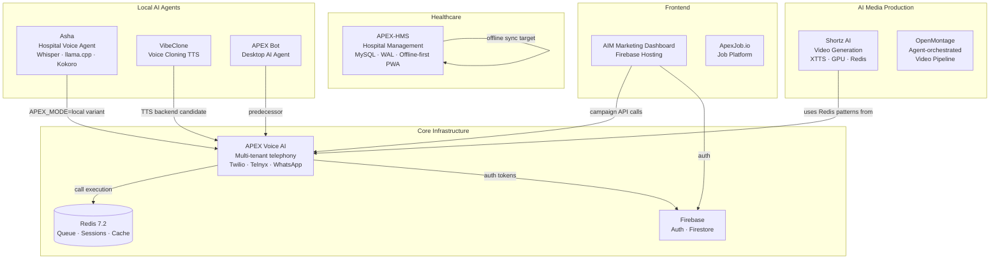

# Engineering Portfolio — Architecture & Systems Overview

> **Author:** Ankit Panicker
> **Generated:** 2026-05-16
> **Scope:** Full codebase analysis across `e:\Projects`, `e:\Ai`, `e:\WEBSITES`

---

## Ecosystem Summary

This is the portfolio of a **solo infrastructure engineer and AI systems builder** who has built a cohesive ecosystem of production-grade AI infrastructure over approximately 12 months. The projects share a consistent engineering philosophy: local-first, cost-constrained, multi-tenant, reliability-focused, built on consumer hardware.

The ecosystem centers on a single core product — **APEX Voice AI** — with surrounding systems that feed into or extend it: a marketing frontend (AIM), an offline HMS for healthcare clients (APEX-HMS), a local video generation tool (Shortz), a fully offline voice agent (Asha), and earlier-generation desktop agents.

---

## Project Inventory

| Project | File | Category | Maturity |
|---|---|---|---|
| APEX Voice AI | [apex_voice_ai.md](apex_voice_ai.md) | Core Product | Production |
| APEX HMS | [apex_hms.md](apex_hms.md) | Healthcare Platform | Near-Production |
| Shortz AI | [shortz_ai.md](shortz_ai.md) | Media Generation | Production (local) |
| Asha Voice Agent | [voice_asha_local_agent.md](voice_asha_local_agent.md) | Local AI Agent | Production (local) |
| VibeClone TTS | [vibeclone_tts.md](vibeclone_tts.md) | AI Infrastructure | Prototype |
| OpenMontage | [open_montage_video_pipeline.md](open_montage_video_pipeline.md) | AI Video Pipeline | Active Development |
| ApexJob.io | [apexjob_platform.md](apexjob_platform.md) | Job Platform | MVP |
| AIM Marketing | [aim_marketing_platform.md](aim_marketing_platform.md) | Marketing Frontend | Production |
| APEX Bot | [apex_automation_bot.md](apex_automation_bot.md) | Desktop Agent | Prototype |

---

## Architecture Map



---

## Project Relationships

### APEX Voice AI is the hub

Every other project connects to APEX Voice AI either as:
1. **A frontend** (AIM → aivoice API)
2. **A client** (HMS → potential aivoice appointment booking integration)
3. **A predecessor** (APEX Bot → evolved into aivoice local mode)
4. **A parallel system** (Asha → same concept as aivoice local mode, different implementation)
5. **A potential backend** (VibeClone → could serve as aivoice's voice cloning TTS backend)
6. **A production tool** (Shortz, OpenMontage → content production for clients who use aivoice)

### The Evolution Arc

```
APEX Bot (desktop AI agent, Feb 2026)
    ↓
Asha local agent (microphone + local LLM, Mar-Apr 2026)
    ↓
VibeClone (voice cloning TTS experiment, Apr 2026)
    ↓
APEX Voice AI (full multi-tenant cloud telephony, Apr-May 2026)
    ↓
AIM Marketing (campaign management frontend, Apr-May 2026)
    ↓ [parallel track]
Shortz (local GPU video pipeline, Mar-Apr 2026)
    ↓
OpenMontage (agent-orchestrated video platform, May 2026)
    ↓ [healthcare vertical]
APEX-HMS (hospital management, offline-first, Mar-Apr 2026)
```

---

## Systems Interaction Overview

### Data Flow: Marketing Campaign

```
AIM Dashboard → POST /api/marketing/broadcast (APEX Voice AI)
    → Rate limit check (per-tenant plan)
    → Circuit breaker check (Twilio breaker)
    → Enqueue job in Redis (priority queue)
    → Worker dequeues job
    → Twilio calls.create() with circuit breaker
    → Call connects → TwiML → WebSocket stream
    → STT (Deepgram) → LLM (Groq) → TTS (Azure/Edge)
    → Audio cache: SHA256 key → mulaw sidecar
    → Twilio playback
    → Status callback → Firebase → AIM real-time update
```

### Data Flow: Hospital Appointment Call

```
HMS patient registration → Appointment booked
    → APEX Voice AI appointment tool call (in-call)
    → get_appointment_store().check_slot()
    → book_appointment() → HMS database
    → LLM confirms: "Your appointment is confirmed for..."
    → TTS response → patient hears confirmation
```

### Data Flow: Content Production

```
Shortz AI → generates narrated video
OpenMontage → produces marketing video
    → These videos are sent to clients via AIM campaigns
AIM → schedules APEX Voice AI outbound calls to promote content
    → voice agent plays audio and collects lead information
```

---

## Infrastructure Philosophy

### 1. Local-First, Cloud-Minimal

Every project is designed to operate primarily on local hardware. Cloud APIs are used for network-dependent capabilities (telephony, cloud STT/TTS) but not for compute. LLMs run locally (llama.cpp, Qwen 2.5). TTS runs locally or via cheap API (Edge TTS). This keeps operating costs near-zero for non-telephony workloads.

### 2. Redis as Universal Backbone

Redis appears in 4 of 9 projects. It serves different roles in each:
- **aivoice:** Job queue (ZSET priority) + session persistence (STRING TTL) + LLM cache + rate limits
- **Shortz:** FIFO job queue (LPUSH/BLMOVE) + job metadata + control plane
- **Asha:** Vector memory (RedisVL) + conversation store
- **VibeClone:** Job queue (LPUSH) + job status

The Redis pattern is consistent: enqueue via push, dequeue via blocking pop (BRPOP/BLMOVE), job metadata in HASH, status tracking by field update.

### 3. Reliability Over Features

Every substantial project implements:
- Retry logic with exponential backoff
- Dead-letter queue for unrecoverable failures
- Circuit breakers for external provider dependencies
- Graceful shutdown with active-connection drain
- Idempotency for webhook endpoints

This is the signature of an engineer who has been burned by production failures and designs defensively from the start.

### 4. Multi-Tenant by Default

APEX Voice AI and APEX-HMS both implement multi-tenancy at the data layer. Tenant isolation via Redis key namespacing (aivoice) and MySQL `tenant_id` row scoping (HMS). RBAC in HMS. Per-tenant rate limiting and concurrency control in aivoice.

### 5. Consumer Hardware Constraints

All GPU work is designed for 4GB VRAM:
- XTTS v2 runs at float16 (~1.7GB)
- faster-whisper small at float16 (~0.3GB)
- Kokoro-82M TTS (~0.2GB)
- Qwen 2.5 0.5B Q4_K_M (~0.5GB)

Total: ~2.7GB — fits on RTX 3050/3060. Models are loaded once and kept resident across jobs (no per-request model loading).

### 6. Offline Operation

Both APEX-HMS and Asha are explicitly designed for intermittent connectivity environments (rural Indian hospitals, poor internet). IndexedDB queue in HMS. No cloud dependency in Asha beyond initial model download.

---

## Shared Operational Patterns

### Pattern 1: Supervisor + Backoff Restart

Both aivoice (Docker supervisor container) and Shortz (shortz_supervisor.py) implement process supervision with exponential backoff restart:

```
crash_count → backoff = min(base × 2^(crash_count-1), max_backoff)
max_attempts → stop trying (operator intervention required)
```

aivoice uses Docker's `restart: always`. Shortz uses Python subprocess management. Both cap restart attempts to prevent infinite restart loops masking fundamental failures.

### Pattern 2: Atomic Queue + Orphan Recovery

aivoice (Redis Lua ZRANGEBYSCORE + ZREM + HSET) and Shortz (BLMOVE) both implement atomic job acquisition. Both have orphan recovery on startup to handle crashes that left jobs in processing state without cleanup.

### Pattern 3: WAL for Durability

APEX-HMS implements a formal WAL (PENDING → COMMITTED → APPLIED). aivoice implements a simpler WAL (`queue_wal.jsonl` file for queue state replay). Both treat write-ahead logging as a requirement for production data integrity.

### Pattern 4: Circuit Breaker + Fallback

aivoice has named circuit breakers for each external provider. Asha has multi-level LLM fallback (4 model candidates). VibeClone has 3-retry per job. The pattern: don't let a single provider failure cascade to full system failure.

### Pattern 5: Idempotency at Webhook Boundaries

aivoice uses Redis NX for Twilio webhook idempotency. APEX-HMS uses database idempotency_registry with UUIDv7 keys. Both prevent the most common distributed systems bug: duplicate processing of retried requests.

---

## Cross-Cutting Technical Assessment

### Strengths (Ecosystem Level)

1. **Consistent Redis usage across projects** — no reinventing the wheel. The queue, session, and cache patterns are portable and reused.

2. **Hardware-aware configuration** — worker concurrency auto-scales to `cpu_count - 1`, VRAM limits are respected via `set_per_process_memory_fraction`, queue sizes are tuned to hardware.

3. **Production failure mode thinking** — circuit breakers, DLQs, orphan recovery, graceful shutdown, and idempotency are present in core systems before they're needed (not bolted on after incidents).

4. **Multilingual engineering** — systems are built for Hindi-primary users (Devanagari script validation, Hindi STT/TTS, hospital system in Hindi). This is a real market differentiator in Indian healthcare and SMB AI.

5. **Offline-first architecture** — HMS + Asha are genuinely offline-capable. This is harder than it looks and correctly addresses the Indian market constraint.

### Weaknesses (Ecosystem Level)

1. **No shared observability infrastructure** — each project has its own logging approach. No unified metrics, no distributed tracing across projects. Debugging cross-project issues (AIM → aivoice → Twilio) requires log correlation across 3 different formats.

2. **Authentication fragmentation** — Firebase Auth (AIM), JWT middleware (HMS), API key (aivoice), no auth (Shortz, VibeClone). No unified identity provider or SSO.

3. **No CI/CD** — no visible GitHub Actions, no automated testing pipeline. Changes are deployed manually. Quality gates are manual code review only.

4. **Kubernetes gap** — Docker Compose throughout. Production deployment requires nginx configuration and manual container management. No K8s readiness (no HPA, no PDB, no liveness probes, no Prometheus).

5. **Documentation debt** — project-level documentation exists (CLAUDE.md files, architecture.md files) but no cross-project documentation or API contract documentation for integrations.

---

## Infrastructure Maturity by Project

| Project | Reliability | Performance | Scalability | Security | Observability |
|---|---|---|---|---|---|
| APEX Voice AI | ★★★★☆ | ★★★★☆ | ★★★☆☆ | ★★★☆☆ | ★★★☆☆ |
| APEX HMS | ★★★★★ | ★★★★☆ | ★★★★☆ | ★★★★☆ | ★★★☆☆ |
| Shortz AI | ★★★★☆ | ★★★★☆ | ★★☆☆☆ | ★★☆☆☆ | ★★★★☆ |
| Asha Agent | ★★★★☆ | ★★★★☆ | ★☆☆☆☆ | ★★★★☆ | ★★★☆☆ |
| VibeClone | ★★☆☆☆ | ★★★☆☆ | ★★☆☆☆ | ★☆☆☆☆ | ★☆☆☆☆ |
| OpenMontage | ★★★☆☆ | ★★★☆☆ | ★★★☆☆ | ★★☆☆☆ | ★★☆☆☆ |
| AIM Marketing | ★★★☆☆ | ★★★☆☆ | ★★★☆☆ | ★★★☆☆ | ★★☆☆☆ |
| APEX Bot | ★★☆☆☆ | ★★☆☆☆ | ★☆☆☆☆ | ★★☆☆☆ | ★★☆☆☆ |
| ApexJob.io | ★★☆☆☆ | ★★☆☆☆ | ★★★☆☆ | ★★☆☆☆ | ★★☆☆☆ |

---

## Strategic Positioning

This portfolio demonstrates the technical capability to:

1. **Build production multi-tenant voice AI infrastructure** from scratch — Twilio/Telnyx integration, real-time WebSocket streaming, provider circuit breaking, session persistence. Few engineers have built this end-to-end.

2. **Design for resource-constrained environments** — consumer GPU, intermittent internet, offline-first. This is harder than cloud-native and more relevant to the Indian SMB and healthcare markets.

3. **Implement distributed systems reliability patterns** correctly — WAL, idempotency, circuit breakers, graceful shutdown — without cargo-culting. Each pattern is present because it solves a real failure mode.

4. **Think in ecosystems** — individual projects are designed to integrate. aivoice + AIM + HMS + Asha form a coherent healthcare AI product. This is product architecture thinking, not just implementation.

5. **Ship working systems** — multiple projects are production-deployed (aivoice, AIM, HMS). This is not a portfolio of side projects; these are running systems serving real use cases.

---

## Recommended Investment Priority

For a technical due diligence or platform engineering evaluation, the order of technical depth:

1. **APEX Voice AI** — most sophisticated, most infrastructure innovation, most production evidence
2. **APEX HMS** — architectural maturity (WAL + SKIP LOCKED + offline-first) demonstrates distributed systems depth
3. **Shortz AI** — interesting local GPU infrastructure with real production supervisor patterns
4. **Asha Voice Agent** — best example of multi-signal VAD and graceful degradation design thinking
5. **OpenMontage** — novel architectural concept (agent-as-orchestrator) worth understanding
