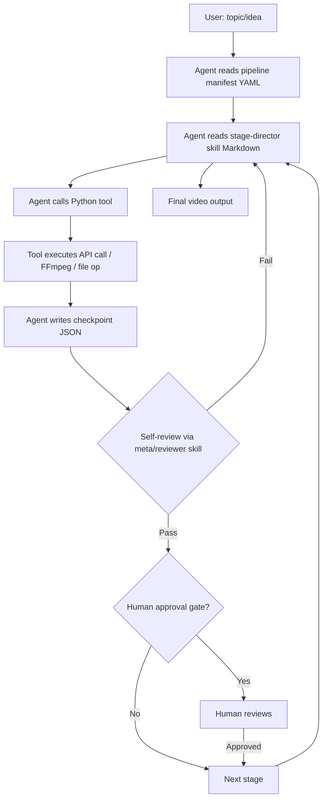

# OpenMontage — Agent-Orchestrated AI Video Production Platform

> **Project path:** `e:\Projects\Motions_video\OpenMontage\ai-avatar-video-pipeline`
> **Architecture:** Agent-first orchestration — LLM coding assistant IS the control plane
> **Stack:** Python tools · YAML pipeline manifests · Remotion (React/Node.js) · HyperFrames · 57+ tool implementations
> **Last major activity:** May 2026

---

## 1. Executive Technical Summary

OpenMontage is a structured video production platform where an LLM coding assistant (Claude Code, Cursor, etc.) acts as the orchestrator. Unlike traditional video pipelines with a Python scheduler, OpenMontage has **no runtime Python orchestrator**. The agent reads YAML pipeline manifests, follows Markdown skill instructions, calls Python tools, writes JSON checkpoints, and reviews its own output at each stage.

**Core operational purpose:** Produce professional short-form and long-form videos for social media, marketing, and education — with consistent quality, structured checkpointing, and multi-provider support for every capability (image, video, audio, avatar).

**Why agent-first:** Traditional automation scripts cannot make creative decisions (which background fits this topic? which TTS voice is most appropriate for this tone?). The LLM agent makes these judgments while the Python tools handle deterministic execution (FFmpeg, API calls, file management).

**What it actually is:** A sophisticated scaffolding system for AI video production. The "platform" is the agent's context window + the tool registry + pipeline manifests + checkpoint state. No servers, no queues, no databases.

---

## 2. System Architecture

### 2.1 Architecture Philosophy



**No background process.** The agent IS the scheduler, decision-maker, quality reviewer, and error handler. Between stages, state persists in checkpoint JSON files. The agent can resume a paused pipeline by reading the checkpoint.

### 2.2 Tool Registry

57+ Python tools auto-discovered via `tool_registry.py`. All inherit from `base_tool.py`:

```python
class BaseTool:
    name: str
    description: str
    def execute(self, **kwargs) -> ToolResult: ...
    def estimate_cost(self, **kwargs) -> CostEstimate: ...
```

Categories:

| Category | Tools |
|---|---|
| `analysis/` | Transcription, scene detection, frame sampling, video understanding |
| `audio/` | TTS (ElevenLabs, OpenAI, Piper local), music generation, mixing, noise enhancement |
| `avatar/` | Talking head animation (HeyGen, D-ID), lip sync |
| `enhancement/` | Upscale (Real-ESRGAN), BG removal, face enhance, color grading |
| `graphics/` | Image gen (FLUX, DALL-E, Recraft), stock search, diagrams, code snippets, math animation |
| `video/` | 13 video generation providers, composition, stitching, trimming |
| `subtitle/` | SRT/VTT generation from Whisper timestamps |

### 2.3 Pipeline Manifest Structure (YAML)

```yaml
pipeline:
  name: "product_demo_short"
  stages:
    - id: brief
      skill: pipelines/product-demo/brief-director
      outputs: [artifacts/brief.json]

    - id: script
      skill: pipelines/product-demo/script-director
      inputs: [artifacts/brief.json]
      outputs: [artifacts/script.json]

    - id: voiceover
      skill: pipelines/product-demo/voiceover-director
      inputs: [artifacts/script.json]
      outputs: [artifacts/voiceover.mp3, artifacts/timestamps.json]
      human_approval: true

    - id: visuals
      skill: pipelines/product-demo/visuals-director
      inputs: [artifacts/script.json, artifacts/timestamps.json]
      outputs: [artifacts/scenes/]

    - id: compose
      skill: pipelines/product-demo/compose-director
      inputs: [artifacts/voiceover.mp3, artifacts/scenes/]
      outputs: [artifacts/final.mp4]
```

### 2.4 Checkpoint Protocol

After each stage, agent writes:
```json
{
  "pipeline": "product_demo_short",
  "stage": "voiceover",
  "status": "completed",
  "timestamp": "2026-05-10T14:23:00Z",
  "artifacts": {
    "voiceover.mp3": "artifacts/voiceover.mp3",
    "timestamps.json": "artifacts/timestamps.json"
  },
  "cost_so_far": { "usd": 0.23, "breakdown": { "elevenlabs": 0.15, "dalle": 0.08 } },
  "decisions": ["Used ElevenLabs Rachel voice for professional tone", "..."]
}
```

Checkpoint enables:
- Resume after agent session timeout
- Human review of decisions between stages
- Cost tracking against budget

### 2.5 Budget Governance

`tools/cost_tracker.py` implements estimate → reserve → reconcile:
1. Before calling a tool: `estimate_cost()` → check against remaining budget
2. Reserve estimated cost
3. After call: reconcile with actual cost from API response
4. If estimate exceeded: log overage, alert agent

Per-stage budget caps configurable in `config.yaml`.

### 2.6 HyperFrames Composer

`remotion-composer/` is a Node.js/React application using Remotion for programmatic video composition. HyperFrames is a framework within it that provides:

- `data-start`, `data-duration`, `data-track-index` attributes for timing
- GSAP timeline registration via `window.__timelines`
- CSS animations, Lottie, Three.js integration
- CLI: `hyperframes init`, `lint`, `preview`, `render`, `transcribe`, `tts`

The agent generates HyperFrames HTML compositions based on script + timestamps, then renders to MP4 via `hyperframes render`.

**Key constraint:** Only deterministic logic — no `Date.now()`, no `Math.random()`, no network fetches in compositions. Enables reproducible renders.

### 2.7 Dual-Provider Principle

Every capability supports both cloud API (paid) and local/open-source (free, GPU-dependent):

| Capability | Cloud Option | Local Option |
|---|---|---|
| TTS | ElevenLabs, OpenAI TTS | Piper (VITS) |
| Image gen | DALL-E, FLUX API, Recraft | local diffusion model |
| Video gen | HeyGen, RunwayML, Kling | (limited) |
| Music | ElevenLabs Sound | MusicGen local |
| Transcription | Whisper API | faster-whisper local |
| Avatar | HeyGen, D-ID | (no free equivalent) |

Provider selection is agent-driven: agent reads which providers are available from `.env`, selects based on quality requirements and budget.

---

## 3. Schema System

`schemas/` directory contains JSON Schema definitions for:
- **11 artifact schemas:** `brief`, `script`, `voiceover_plan`, `scene_plan`, `visual_assets`, `composition_spec`, `render_config`, `publish_log`, and others
- **Checkpoint state schema**
- **Pipeline manifest schema**
- **Tool-specific schemas**

Agents validate their JSON outputs against these schemas before writing checkpoints. Schema violations cause the agent to self-correct rather than propagate invalid state to the next stage.

---

## 4. Engineering Assessment

**Strengths:**
- Agent-as-orchestrator is genuinely novel — no equivalent Python script could make the creative decisions required for video production
- Dual-provider support with cost tracking is production-quality for managed generation workflows
- Checkpoint system enables long-running pipelines that span multiple sessions
- 57+ tool implementations provide broad capability coverage
- HyperFrames composition is deterministic and reproducible
- Schema validation at every stage prevents invalid state propagation

**Weaknesses:**
- No parallelism — agent executes stages serially; GPU operations (image gen, video gen) could parallelize
- Agent context window is the hard limit — very long pipelines risk losing early stage context
- No automated retry on tool failures — agent must manually decide to retry
- No monitoring/dashboard — pipeline progress only visible in agent output
- Vendor lock-in risk: 13 video providers but no abstraction layer for portable code
- Local GPU tools require specific hardware; cloud-only fallback may be cost-prohibitive for batch

**Operational maturity:** Conceptually high, operationally young. The architecture is sophisticated; the tooling is comprehensive. Missing: automated testing of tool implementations against provider APIs, cost prediction accuracy validation, pipeline execution logs for debugging.

**Innovation:** The agent-first orchestration model is a genuine architectural innovation. It solves the fundamental problem of creative production automation: algorithms can't replace taste, but they can execute. The agent provides taste; the tools provide execution.

---

## 5. Future Evolution Path

1. **Parallel stage execution:** Identify independent stages (visuals + voiceover can often parallel). Agent spawns parallel sub-agents. Checkpoint merges parallel results.

2. **Pipeline versioning:** Git-backed pipeline manifests + checkpoint artifacts. `hyperframes publish` creates a versioned pipeline run. Enables A/B testing of pipeline variants.

3. **Quality eval harness:** After compose stage, run automated quality checks (frame composition score, audio quality metric, subtitle accuracy). Pass/fail gates before publish.

4. **Cost prediction accuracy:** Track estimate vs actual per provider per tool. Feed back into estimate model. Reduce budget reservation overshoot.

5. **Real-time preview:** During `compose` stage, stream partial renders to a browser preview. Reduces iteration time from minutes to seconds.

6. **Publish automation:** Direct publish to YouTube, Instagram, TikTok via `publishers/` tools (currently reserved). Pipeline runs end with a published URL, not just a local MP4.
