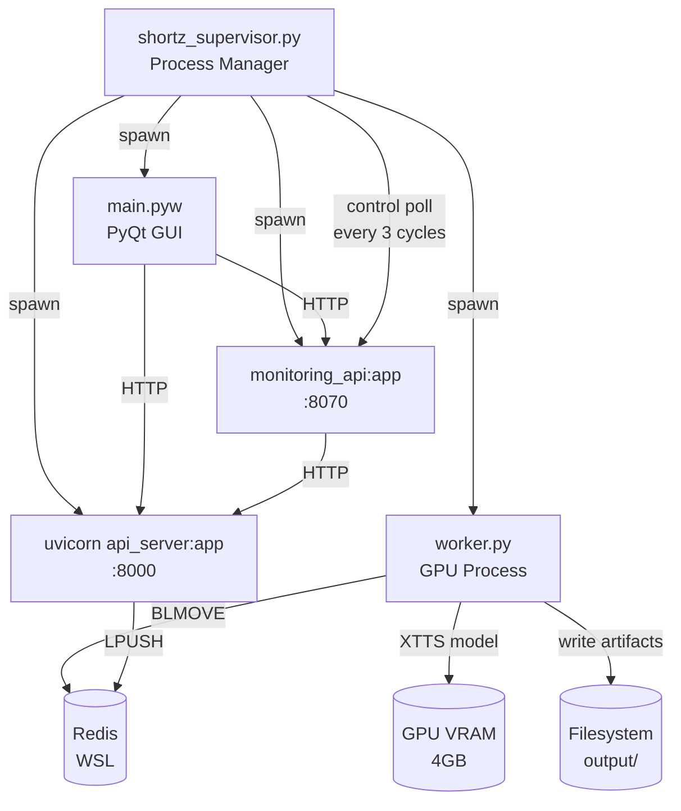
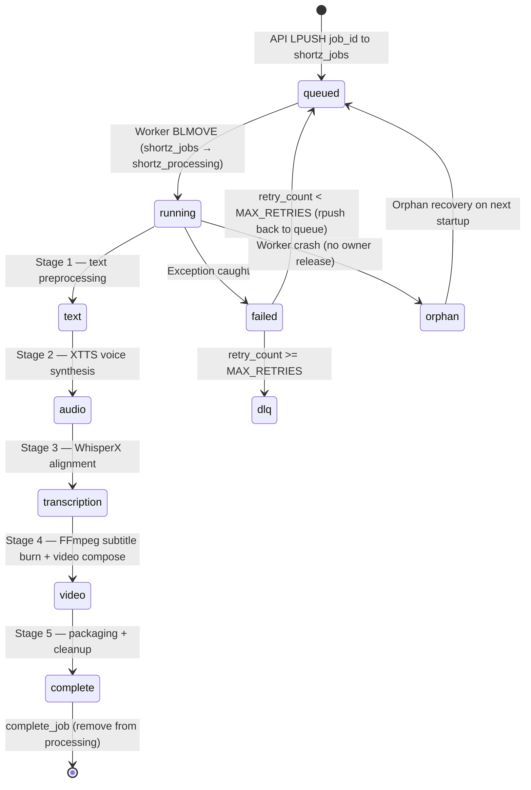

# Shortz AI — Short-Form Video Generation Platform

> **Project path:** `e:\Projects\Shortz`
> **Stack:** Python · FastAPI/Uvicorn · Redis (via WSL) · XTTS v2 (GPU TTS) · PyQt GUI · Windows
> **Execution model:** Multi-process supervisor → Worker (GPU) + API Server + Monitoring API + GUI
> **Last major activity:** March 2026

---

## 1. Executive Technical Summary

Shortz is a local AI short-form video generation pipeline running on a single Windows machine. It converts text scripts into narrated short videos with XTTS v2 voice cloning, subtitle generation, and video composition. The system runs entirely locally on consumer GPU hardware (4GB+ VRAM).

**Core operational purpose:** Generate short-form video content (social media clips, product demos, narrated explainers) without cloud video generation APIs. All AI inference runs locally: XTTS for voice, WhisperX for transcription, FFmpeg for video assembly.

**Why the architecture exists:** Cloud video generation APIs ($0.02–$0.10/second) are cost-prohibitive for batch content production. Local GPU inference amortizes the hardware cost across unlimited generations. The multi-process supervisor architecture allows the expensive XTTS model to stay loaded in GPU VRAM across multiple jobs, eliminating the 30-60s model load time per job.

**Key constraints:**
- Windows + WSL hybrid (Redis runs in WSL, Python runs in Windows)
- 4GB VRAM GPU (RTX 3050 class) — XTTS barely fits
- Single GPU — no concurrent model inference
- No persistent internet dependency after initial model download

---

## 2. System Architecture

### 2.1 Process Topology



### 2.2 Job Lifecycle



### 2.3 5-Stage Pipeline

```
Stage 1: Text Processing
  - Script normalization
  - Sentence segmentation
  - Pronunciation correction for XTTS

Stage 2: Audio Generation (GPU)
  - XTTS v2 voice synthesis
  - Voice cloning from reference audio
  - Multi-chunk generation for long scripts

Stage 3: Transcription Alignment
  - WhisperX word-level timestamp alignment
  - SRT subtitle file generation

Stage 4: Video Composition
  - Background video selection
  - Subtitle burn-in via FFmpeg
  - Audio + video mux

Stage 5: Output Packaging
  - final.mp4 write to output/{job_id}/
  - Redis status update (complete, progress=100)
  - Artifact cleanup
```

### 2.4 Redis Queue Design

**Queue key:** `shortz_jobs` (FIFO LIST)
**Processing key:** `shortz_processing` (LIST — in-flight tracking)
**Job metadata:** `job:{id}` HASH — `status`, `stage`, `progress`, `retry_count`, `trace_id`, `last_error`, `last_error_type`
**DLQ key:** `shortz_dlq` LIST
**Control plane:** `shortz_control` HASH — `paused`, `drain`, `stop`, `restart` flags

Worker uses `BLMOVE shortz_jobs shortz_processing 0` (blocking pop with atomic move to processing list). This is the classic reliable queue pattern: job exists in exactly one list at all times.

**Job ownership:** `worker_owner:{job_id}` STRING with TTL. Worker sets this before processing, clears it on completion. Orphan recovery on startup: scan `shortz_processing`, for any job with no owner key → requeue.

---

## 3. Core Infrastructure Components

### 3.1 ResourceManager (GPU Model Lifecycle)

`worker/resource_manager.py` manages the XTTS model lifecycle:

- **Load once:** `mgr.load_tts()` called at worker startup. XTTS v2 (~1.7GB VRAM) loads into GPU once, stays resident for all jobs.
- **Cache:** ResourceManager is singleton within the worker process — all pipeline runs share the same model instance.
- **OOM recovery:** GPU OOM triggers `torch.cuda.empty_cache()` + `gc.collect()`. Worker does not crash — it nacks the job for retry.
- **Shutdown:** `mgr.shutdown()` called on worker exit — releases GPU handles cleanly.

This design is essential for 4GB VRAM constraints: model reload per job would use ~2× VRAM during load (old model partially unloaded, new loading) and cost 30-60s per job.

### 3.2 Process Supervisor

`shortz_supervisor.py` is the master process:

**Startup sequence:**
1. Verify WSL availability (`wsl echo OK`)
2. Start Redis via WSL (`wsl redis-server --daemonize yes`) + PONG retry (15 attempts, 2s interval)
3. Start Worker + detect XTTS readiness (watch `logs/worker.log` for "Voice Model Online" string, up to 300s)
4. Start API server + wait for `/health` (up to 30s, 1s poll)
5. Start Monitoring API + wait for `/health` (up to 15s)
6. Start GUI

**Monitor loop:**
- Runs every 5s
- Checks GUI exit code (code 0 = clean shutdown; non-zero = restart GUI)
- Checks API crash → restart with exponential backoff (base 2s, max 60s, max 10 attempts)
- Checks Worker crash → restart + re-detect XTTS
- Checks Monitoring crash → restart
- Polls control plane every 3 cycles for operator restart requests

**Design decision:** Supervisor does NOT call `/generate`. Only the GUI initiates jobs. This prevents the supervisor's own health monitoring from accidentally submitting duplicate jobs.

### 3.3 Control Plane

`core/control.py` implements Redis-backed control flags:

```python
is_paused(r)    # r.hget('shortz_control', 'paused') == '1'
is_draining(r)  # r.hget('shortz_control', 'drain') == '1'
should_stop(r)  # r.hget('shortz_control', 'stop') == '1'
```

Worker checks these at the top of each dequeue cycle. Pause suspends job pickup without killing the process (model stays loaded). Drain exits cleanly after current job. Stop exits immediately.

Operator can set these via the Monitoring API, which the supervisor polls every 15s.

### 3.4 Structured Logging (Tier-3)

`core/log_event.py` emits JSON-structured events:

```json
{
  "timestamp": "2026-03-31T14:21:24.000Z",
  "level": "INFO",
  "worker_id": "gpu-worker-1",
  "trace_id": "abc123",
  "job_id": "uuid-here",
  "stage": "audio",
  "event": "tts_chunk_complete",
  "chunk_index": 3,
  "duration_ms": 1240
}
```

Thread-local context (`set_context(job_id, trace_id, worker_id)`) means all log lines for a job are automatically tagged without passing context through every function call.

### 3.5 GUI Architecture (PyQt)

`main.pyw` → `services/gui_main.py`: PyQt5 desktop application.

Key design: `ActiveJobDetectorThread` polls API for pending jobs on startup. This is the designed auto-start mechanism — not the supervisor. The supervisor only starts the GUI process; the GUI decides whether to auto-submit a job.

GUI communicates with API via HTTP (`services/api_client.py`). No direct Redis access from GUI — all operations go through the API server.

---

## 4. Reliability Engineering

### 4.1 Crash Recovery

**Worker crash during job:**
- Job stays in `shortz_processing` LIST
- `worker_owner:{job_id}` key expires (TTL-based)
- On next worker startup, `_recover_orphans()` scans `shortz_processing`, detects jobs without owner key, requeues them

**API crash:**
- Jobs in queue are unaffected (Redis persists)
- GUI requests fail until API restarts
- Supervisor detects API crash within 5s, restarts with backoff

**Redis crash (WSL process killed):**
- All in-memory queue state is lost
- Active job is lost — must be resubmitted
- Mitigation: Redis AOF not always enabled in WSL default config (see weakness)

### 4.2 Retry Logic

Error classification drives retry behavior:

| Error Type | Retry | Action |
|---|---|---|
| GPU_OOM | Yes | `torch.cuda.empty_cache()` + requeue |
| timeout | Yes | Requeue with retry counter |
| redis_error | No | Worker loop continues (Redis reconnect) |
| ffmpeg_error | Yes | Requeue (transient) |
| io_error | No | DLQ (file system issue, won't resolve) |
| stage_error | Yes | Requeue up to MAX_RETRIES |

After `MAX_RETRIES`, job moves to `shortz_dlq` LIST for operator inspection.

### 4.3 XTTS Readiness Detection

Supervisor watches worker log file for "Voice Model Online" string (written by ResourceManager after successful XTTS load). Only after this confirmation does the supervisor start the GUI. This prevents the GUI's auto-start from submitting a job before the GPU model is ready — which would cause immediate failure and retry churn.

---

## 5. Performance Engineering

### 5.1 VRAM Budget (4GB)

| Component | VRAM |
|---|---|
| XTTS v2 (float16) | ~1.7GB |
| WhisperX small | ~0.5GB |
| PyTorch overhead | ~0.3GB |
| OS/driver | ~0.3GB |
| **Total** | ~2.8GB |
| Headroom | ~1.2GB |

On 4GB VRAM, this is tight. Simultaneous XTTS + WhisperX inference would risk OOM on peak memory usage. The sequential 5-stage pipeline avoids this: XTTS runs in stage 2, WhisperX in stage 3 — never simultaneously.

### 5.2 Job Latency

Typical per-job latencies (RTX 3050, 60s script):
- Text processing: <1s
- XTTS audio generation: 15-45s (depends on script length, voice complexity)
- WhisperX alignment: 5-15s
- FFmpeg video compose: 10-30s (depends on resolution, effects)
- Total: **30-90s per job**

Single-worker bottleneck: jobs are strictly sequential. Queue builds up if submissions rate > ~1 job/90s.

### 5.3 Redis on WSL Latency

Redis runs in WSL, Python worker runs in Windows. Cross-WSL loopback adds ~1-2ms per Redis operation vs native. Acceptable for job queue operations (not hot path). BLMOVE blocks for up to the dequeue timeout — no busy-wait overhead.

---

## 6. Operational Constraints

### 6.1 Windows + WSL Hybrid

The most significant operational friction. Redis must run in WSL; the supervisor manages this via `subprocess.run(["wsl", "redis-cli", "ping"])`. If WSL is disabled or the WSL distribution is deleted, the entire stack fails to start.

No Dockerization of the GPU worker — Docker on Windows with GPU passthrough (NVIDIA Container Toolkit) is possible but complex. The supervisor subprocess model is pragmatic for Windows-first development.

### 6.2 Single GPU Constraint

All GPU inference is serialized through the single worker process. No parallel job processing. No GPU time-sharing between XTTS and WhisperX — they run sequentially within a job.

Mitigation: start multiple worker processes → multiple Redis queue consumers. This works for batch throughput but each worker needs its own GPU (or time-shares a single GPU with `torch.cuda.set_per_process_memory_fraction`). Not implemented.

### 6.3 XTTS Load Time

XTTS takes 30-60s to load on first startup. The supervisor's `XTTS_DETECT_TIMEOUT=300s` accommodates slow machines. During this window, the API server is running but no jobs can complete. The GUI's auto-start is held until XTTS confirms ready.

---

## 7. Testing & Chaos Engineering

### 7.1 Validation Scripts

`_tier3_validate.py` and `_validate.py` — startup validation scripts that check:
- Redis connectivity
- GPU availability
- XTTS model file presence
- FFmpeg installation
- Required directories exist

### 7.2 Failure Simulation

`tests/` directory contains soak and concurrency tests. The supervisor's exponential backoff is validated by the test suite.

### 7.3 Uncovered Risks

- **Redis data loss on WSL shutdown:** If Windows fast-starts (hibernation), WSL processes are killed without clean shutdown. Redis data in WSL may not flush to disk. No AOF/RDB verification in the startup sequence.
- **GPU OOM mid-chunk:** XTTS generates audio in chunks. An OOM mid-chunk leaves partial audio files. Recovery path nacks the job, but partial audio files accumulate in the output directory.
- **FFmpeg version incompatibility:** No FFmpeg version check. Subtitle filter syntax changes between FFmpeg versions. Silent corruption (malformed subtitles) possible.
- **Long-running job timeout:** No per-job timeout. A stuck XTTS inference (model deadlock, GPU hang) blocks the worker indefinitely. Control plane drain/stop is the only recovery.

---

## 8. Security & Isolation

### 8.1 Process Isolation

GPU worker runs in a separate process from the API server. A crash in the worker does not affect the API's ability to accept new jobs. Conversely, an API server crash does not interrupt an in-progress job.

### 8.2 API Authentication

No authentication on the API or Monitoring API. Both listen on `127.0.0.1` only — not exposed to LAN or internet by default. Acceptable for single-user local deployment. Would need API key protection if exposed via reverse proxy.

### 8.3 Installer

`installer.iss` (Inno Setup) packages the stack as a Windows installer. Builds to `dist/guardian.exe`. No code signing evident — Windows SmartScreen will block unsigned executables.

---

## 9. Notable Bugs & Production Incidents

### Bug 1: Supervisor Calling /generate (Duplicate Jobs)

**Root cause:** Original supervisor design called `/generate` as part of health verification. This created a job on every restart — including crash-recovery restarts.

**Fix:** Supervisor was redesigned to never call `/generate`. Only the GUI's `ActiveJobDetectorThread` submits jobs. Supervisor health check calls `/health` only.

**Lesson:** Process supervisors must not trigger business logic. Health endpoints must be side-effect-free.

### Bug 2: GUI Race Condition on Startup

**Root cause:** Supervisor started GUI before API health was confirmed. GUI's 500ms auto-start timer fired before API was ready, causing 500 errors that were retried — creating multiple job submissions.

**Fix:** `wait_for_api()` polls `/health` before starting GUI. Now GUI always finds a ready API.

**Lesson:** Readiness probes must complete before dependent processes start. `sleep(2)` is not a readiness probe.

### Bug 3: Orphan Jobs Accumulating

**Root cause:** Jobs in `shortz_processing` with no live owner were never requeued on worker restart. Processing list grew without bound. Jobs submitted after a crash were processed but old orphans stayed in processing forever.

**Fix:** `_recover_orphans()` called at startup. Scans processing list, checks `worker_owner:{job_id}` TTL, requeues orphans.

**Lesson:** The BLMOVE reliable-queue pattern requires startup orphan recovery. Without it, crashes silently lose jobs.

---

## 10. Scalability Analysis

### 10.1 Current Limits

| Dimension | Limit | Bottleneck |
|---|---|---|
| Throughput | ~1 job/30-90s | Single GPU worker |
| Queue depth | Unlimited (Redis) | Storage |
| Concurrent users | ~10 | API + Redis can handle; GPU is bottleneck |
| VRAM | 4GB hard limit | XTTS model size |

### 10.2 Scaling Path

1. **Second GPU:** Add second worker process with dedicated GPU. Redis BLMOVE naturally distributes jobs across workers. No code changes needed.

2. **Better GPU (12GB+):** XTTS in float32 (higher quality). Concurrent XTTS + WhisperX runs. 2-3× throughput improvement.

3. **Dockerize GPU worker:** NVIDIA Container Toolkit on Linux. Eliminates WSL complexity. Enables K8s GPU node pools for horizontal scaling.

4. **Cloud burst:** Queue overflow to cloud video generation API (Synthesia, HeyGen). Local first, cloud fallback. Requires provider abstraction in pipeline runner.

---

## 11. Engineering Assessment

**Strengths:**
- Supervisor restart backoff with crash counter is production-grade
- XTTS readiness detection via log parsing is pragmatic (model load is opaque — no API to query)
- Redis BLMOVE reliable queue with orphan recovery is correct
- Control plane (pause/drain/stop) is operationally sophisticated for a local tool
- Tier-3 structured logging with trace context is genuinely production-grade
- Error type classification for intelligent retry routing

**Weaknesses:**
- WSL dependency for Redis is fragile — Redis should run as Windows service or in Docker
- No AOF persistence verification — Redis data loss on improper shutdown
- No per-job timeout — GPU hang blocks worker indefinitely
- No FFmpeg version compatibility check
- API + Monitoring have no authentication
- Unsigned installer — Windows SmartScreen blocks distribution

**Operational maturity:** Medium-High for a local tool. The supervisor, control plane, and structured logging demonstrate production engineering thinking. The WSL fragility and auth gaps are the main gaps.

---

## 12. Future Evolution Path

1. **Replace WSL Redis with Windows Service:** Redis for Windows (or Docker Desktop) as a proper Windows service. Eliminates WSL dependency and startup fragility.

2. **Per-job timeout:** Wrap each pipeline stage in `concurrent.futures.ProcessPoolExecutor` with `timeout`. Kill stuck GPU processes cleanly.

3. **Multi-GPU support:** Worker registry with GPU allocation. Each worker claims a GPU device at startup. Queue is shared; workers compete via BLMOVE.

4. **REST API authentication:** Simple API key. Needed before LAN exposure.

5. **Cloud video API fallback:** When GPU is unavailable or VRAM insufficient, route to HeyGen/Synthesia API. Transparent to queue consumers.

6. **Docker Compose on Linux:** Containerize all components. Worker gets NVIDIA runtime. Eliminates WSL, enables deployment on Linux GPU server.
