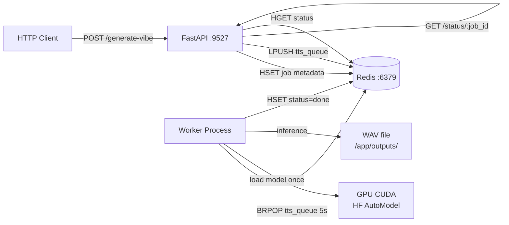

# VibeClone — Voice Cloning TTS Platform

> **Project path:** `e:\Projects\vibeclone`
> **Stack:** Python · FastAPI · Redis · Docker Compose · HuggingFace AutoModel (CUDA) · gTTS fallback
> **Architecture:** HTTP API → Redis LPUSH job queue → GPU Worker
> **Last major activity:** April 2026

---

## 1. Executive Technical Summary

VibeClone is a containerized voice cloning text-to-speech system. It exposes a simple HTTP API to submit TTS generation jobs, queues them in Redis, and processes them with a GPU-accelerated HuggingFace model loaded at startup. Two job types: `tts` (language-based gTTS fallback) and `vibe` (GPU voice cloning with style presets).

**Core purpose:** On-demand voice generation for content creation — narrations, demos, social media content. The `vibe` job type generates audio with configurable voice style (Indian male/female presets) using a custom HuggingFace model.

**Architecture rationale:** Separating API from GPU worker allows the API to remain responsive while GPU inference runs synchronously. Redis queue provides natural backpressure — the API rejects jobs only when Redis is unavailable, never due to GPU load.

---

## 2. System Architecture



### 2.1 Job Data Model

Redis HASH `job:{id}`:
```
type: "vibe" | "tts"
text: input text (max 300 chars)
speaker: voice preset
language: language code (tts type)
style: style description (vibe type)
status: "queued" | "processing" | "completed" | "done" | "failed"
file: output WAV path
error: error message if failed
output: (vibe type) WAV path
```

### 2.2 Worker Behavior

```python
# GPU setup at startup (once)
torch.cuda.set_per_process_memory_fraction(0.85, 0)  # cap at 85% VRAM
model = AutoModel.from_pretrained(MODEL_PATH, torch_dtype=torch.float16).to("cuda")
processor = AutoProcessor.from_pretrained(MODEL_PATH)

# Job loop
while True:
    job = redis_client.brpop("tts_queue", timeout=5)
    # dispatch to vibe_handler or tts_handler
```

**Vibe job execution:**
1. Build style prompt: `"Speaker (Indian male voice, neutral accent...): {text}"`
2. `processor(text=prompt, return_tensors="pt").to("cuda")`
3. `model.generate(**inputs)` with `torch.inference_mode()`
4. Write WAV at 24kHz via soundfile
5. `torch.cuda.empty_cache()` after each job

**TTS job execution (fallback):**
1. `gTTS(text=text, lang=language).save(mp3_path)`
2. `pydub.AudioSegment.from_mp3(mp3_path).export(wav_path, format="wav")`
3. Delete intermediate MP3

**Retry logic:** Max 3 attempts per job, per-attempt exception catch. Worker doesn't crash on job failure — logs error and continues.

---

## 3. Infrastructure

### 3.1 Docker Compose

```yaml
services:
  redis: redis:7-alpine → :6379
  api: FastAPI → :9527
  worker: GPU worker
```

No GPU specification in compose file — requires manual `--gpus all` or `--runtime nvidia` flag. This is a deployment gap.

### 3.2 VRAM Management

`torch.cuda.set_per_process_memory_fraction(0.85, 0)` — reserves 85% of GPU memory for this process, leaving 15% for OS + display. Prevents OOM from other processes while allowing near-full model utilization.

`torch.float16` model weights — half-precision inference, ~2× VRAM efficiency vs float32.

`torch.set_grad_enabled(False)` at module level — global gradient computation disabled. Eliminates overhead and memory for backward passes.

---

## 4. Engineering Assessment

**Strengths:**
- Clean separation: API handles HTTP, worker handles GPU
- `BRPOP` blocking pop is efficient (no busy-wait polling)
- GPU memory fraction reservation prevents OOM conflicts
- Simple job status polling via `/status/{job_id}`

**Weaknesses:**
- No DLQ — failed jobs silently accumulate with `status: failed` in Redis, never cleaned up
- No job timeout — stuck GPU inference blocks worker indefinitely
- No orphan recovery — worker crash leaves job in `processing` status forever (actually: status is set to `processing` immediately, but if worker crashes, status never advances to `done/failed`)
- `MAX_CHARS=300` is a hard truncation, not a graceful error
- No authentication on API
- Docker GPU specification missing from compose
- `decode_responses=False` on Redis client but job data stored as strings — inconsistent, causes `b"type"` byte key lookup bugs in worker (`job_data.get(b"type", b"").decode()`)

**Critical bug:** The worker reads job data with `hgetall` but Redis client uses `decode_responses=False`. All keys are bytes. The field access is `job_data.get(b"type")` — but in the `tts` branch, `job_id` is read from `job_data.get(b"job_id")` which is wrong (job_id comes from BRPOP, not the hash). The `tts` handler has a logic bug where it re-reads `job_id` from the hash instead of using the one from BRPOP.

**Operational maturity:** Low. No structured logging, no monitoring, no cleanup, no DLQ. Works for single-user local use; needs significant hardening for production.

---

## 5. Future Evolution Path

1. **Fix byte key bug:** Set `decode_responses=True` on Redis client. All field access becomes string keys.
2. **Add DLQ and cleanup:** Move failed jobs to DLQ after max retries. TTL on completed job metadata.
3. **Job timeout:** `concurrent.futures.ThreadPoolExecutor` with timeout wrapping model inference.
4. **GPU spec in Docker:** `deploy.resources.reservations.devices` with `capabilities: [gpu]`.
5. **Unified with APEX Voice:** The audio cache in aivoice could consume VibeClone as a TTS backend for voice cloning, replacing Edge TTS with cloned voices per tenant.
