# Voice — Asha Local Voice AI Agent

> **Project path:** `e:\Projects\Voice`
> **Stack:** Python · faster-whisper · llama.cpp (local LLM) · Kokoro-82M TTS · RedisVL vector search · sounddevice
> **Mode:** Fully offline voice agent — microphone → STT → local LLM → local TTS → speaker
> **Last major activity:** April 2026

---

## 1. Executive Technical Summary

Asha is a fully local Hindi voice AI agent for Apple Superspeciality Hospital, Burhanpur. It runs entirely on local hardware — no cloud APIs required after model download. The agent listens via microphone, transcribes speech with faster-whisper (CUDA), generates contextually-aware responses via a local llama.cpp server (Qwen 2.5 0.5B quantized), and speaks responses via Kokoro-82M TTS in real-time.

**Core operational purpose:** Hospital reception automation that works during internet outages. Greets patients, provides hospital information, assists with appointment inquiries. Specifically tuned for Hindi (Devanagari) and the Burhanpur hospital's domain.

**Why local:** Rural Indian hospital. Intermittent 2G-4G internet. Cloud STT/LLM/TTS would fail during outages that may last hours. Local inference on available GPU hardware provides 24/7 availability regardless of connectivity.

**Key innovations:**
- Multi-signal voice activity detection (VAD) beyond simple energy threshold
- Adaptive noise floor estimation for hospital ambient noise
- LLM streaming with sentence-level pipelined TTS (overlap generation + playback)
- RedisVL vector memory with graceful fallback to in-process cosine similarity
- Prompt echo detection to prevent system prompt leakage in responses
- Hindi script validation to reject hallucinated non-Hindi LLM outputs

---

## 2. System Architecture

### 2.1 Component Flow

```mermaid
graph LR
    MIC[Microphone<br/>sounddevice] -->|PCM chunks<br/>16kHz| AQ[audio_queue<br/>Queue]
    AQ -->|get_audio_chunk| VAD[Voice Activity<br/>Detector]
    VAD -->|valid speech| STT[faster-whisper<br/>small CUDA]
    STT -->|Hindi transcript| MEM[VectorMemory<br/>RedisVL search]
    MEM -->|past context| LLM[llama.cpp<br/>:8080/completion<br/>stream=True]
    LLM -->|token stream| SENT[sentence splitter<br/>sentence_queue]
    SENT -->|sentence| TTS[Kokoro-82M<br/>KPipeline Hindi]
    TTS -->|numpy audio| SPK[sounddevice<br/>play_audio 24kHz]
    SPK -->|completed turn| MEM2[vector_memory.add_turn]
    MEM2 --> MEM
```



### 2.2 VAD Pipeline — Multi-Signal

The voice activity detector is the most engineered component. It runs 4 independent checks before invoking the expensive STT:

```
Signal 1: RMS energy threshold
  rms < SILENCE_RMS_THRESHOLD (0.025) → skip

Signal 2: Speech duration gate
  duration_sec < MIN_SPEECH_DURATION_SEC (0.45s) → skip

Signal 3: Spectral analysis (voice band ratio)
  FFT power in 85-3400 Hz range / total power
  voice_band_ratio < 0.45 → skip (not voice frequency spectrum)

Signal 4: Zero-crossing rate
  zcr < 0.01 → noise/hum (too few crossings)
  zcr > 0.22 → sibilance/noise (too many crossings)

Signal 5: SNR estimate
  20 * log10(rms / noise_floor_rms) < -5dB → skip

All 5 pass → invoke Whisper
```

**Adaptive noise floor:** `noise_floor_rms` updates continuously from silence frames:
```python
target = min(feats["rms"], noise_floor_rms * 1.2)
noise_floor_rms = 0.95 * noise_floor_rms + 0.05 * target
```
This exponential smoothing (α=0.05) adapts to hospital ambient noise (AC units, background chatter) without requiring manual calibration.

### 2.3 STT Quality Filtering

After Whisper transcription, 4 additional quality gates:

```
Gate 1: Minimum length
  len(text) < 3 chars → skip

Gate 2: No-speech probability
  no_speech_prob > 0.60 → probably silence

Gate 3: Log probability threshold
  avg_logprob < -0.90 → low-confidence transcription

Gate 4: Compression ratio
  compression_ratio > 2.2 → Whisper hallucination pattern

Gate 5: Hindi character ratio
  hindi_char_ratio(text) < 0.55 → not Hindi / non-target language
```

The compression ratio check is specifically for Whisper hallucinations — when Whisper generates repetitive/looping text, the compression ratio spikes above 2.0.

### 2.4 LLM Streaming + Pipelined TTS

```python
# Producer (thread): streams LLM tokens, emits complete sentences
def producer():
    _stream_llm_sentences_sync(text, 
        lambda s: loop.call_soon_threadsafe(sentence_queue.put_nowait, s),
        stop_event=stop_stream_event)
    sentence_queue.put_nowait(None)  # sentinel

# Consumer (async): receives sentences, synthesizes + plays immediately
while True:
    sentence = await sentence_queue.get()
    if sentence is None:
        break
    audio_out = await asyncio.to_thread(kokoro_tts, sentence)
    await asyncio.to_thread(play_audio, audio_out)
```

This pipeline overlaps LLM generation with TTS synthesis and audio playback:
- While LLM generates sentence 2, TTS synthesizes sentence 1
- While audio plays sentence 1, LLM generates sentence 3
- First-audio latency = time to generate first sentence + TTS synthesis time

**MAX_REPLY_SENTENCES = 2:** After 2 sentences, `stop_stream_event.set()` signals the producer to stop. The remaining LLM stream is discarded. This caps response length for hospital use case (patients expect short, clear answers).

### 2.5 Vector Memory (RedisVL)

`VectorMemory` stores conversation turns as vector embeddings for retrieval-augmented context:

**Embedding model:** `intfloat/e5-small-v2` (SentenceTransformer) → 384-dim vectors, truncated to 256-dim for RedisVL schema compatibility.

**Storage:** Redis HASH with FLAT vector index (`cosine` distance). Index name: `asha_memory_idx`.

**Fallback:** If Redis is unavailable, `fallback_store` holds last 200 turns in-process as `(text, numpy_vector)` tuples. Cosine similarity computed directly in NumPy:
```python
scored = [(float(np.dot(qvec, vec)), text) for text, vec in fallback_store]
```

**Hash fallback embedding:** If `sentence-transformers` not installed, bag-of-words hash embedding:
```python
vec[hash(token) % VECTOR_DIMS] += 1.0
```
Primitive but functional for Hindi keyword matching.

**Context injection:** Top-1 memory hit injected into system prompt as "पुराना संदर्भ" (past context). Prevents repeating the same questions to patients.

### 2.6 LLM Fallback Chain

4-tier model fallback for llama.cpp:
```python
model_candidates = [
    LLM_MODEL,                           # configured model
    "qwen2.5-0.5b-instruct-q4_k_m.gguf", # explicit path
    "default",                            # llama.cpp default
    None,                                 # no model param
]
```
Tries OpenAI-compatible `/v1/chat/completions` first, falls back to raw `/completion` endpoint. This handles different llama.cpp server versions and configurations.

### 2.7 Hindi Validation + Rewrite

After LLM response:
```
1. is_mostly_devanagari(reply) → check ≥60% Hindi characters
2. If not Hindi → force_hindi_rewrite_sync(reply) via mini-prompt
3. If rewrite also not Hindi → hardcoded fallback response
4. looks_like_prompt_echo(reply) → detect system prompt leakage → hardcoded fallback
```

`looks_like_prompt_echo()` checks for markers like "आपका नाम आशा है", "वर्चुअल असिस्टेंट" — phrases from the system prompt that indicate the LLM is repeating its instructions rather than answering.

---

## 3. Core Infrastructure Components

### 3.1 Audio I/O Architecture

```
sounddevice.InputStream(
    samplerate=16000, channels=1, blocksize=1024,
    callback=audio_callback  # puts chunks in audio_queue
)
```

Audio callback is non-blocking — appends to `queue.Queue()`. `get_audio_chunk()` collects chunks until `CHUNK_DURATION=0.5s` of audio is gathered, with a hard timeout at `AUDIO_CAPTURE_TIMEOUT_SEC=3.0s`.

**Echo guard:** After speaking, agent ignores audio for `ECHO_GUARD_SEC=1.2s`. Prevents the agent from transcribing its own TTS output (especially important without acoustic echo cancellation hardware).

**Beep signaling:**
- 1400 Hz beep → listening
- 600 Hz beep → thinking
- 1200 Hz startup beep
- 300 Hz error beep

Provides acoustic feedback without screen UI dependency.

### 3.2 Kokoro TTS

`KPipeline(lang_code='h', repo_id='hexgrad/Kokoro-82M')` — 82M parameter local TTS model.

Voice fallback: tries `hf_alpha` (preferred Hindi female), falls back to `hf_beta`. Kokoro runs on GPU if available, CPU otherwise.

Audio generated as numpy float32 at 24kHz. Played directly via `sounddevice.play(audio, samplerate=24000)`.

**Chunking:** Text split on `.?!।` before TTS — shorter inputs produce more natural prosody. Each sentence chunk is synthesized + played independently.

### 3.3 Latency Tracking

`LatencyTracker` records timestamps at each pipeline stage:
```
start → audio_captured → stt_done → llm_done → tts_chunk_done → playback_done
```
Reports breakdowns like:
```
start → audio_captured: 0.500s
audio_captured → stt_done: 1.240s
stt_done → llm_done: 0.820s
llm_done → tts_chunk_done: 0.640s
tts_chunk_done → playback_done: 3.200s
TOTAL: 6.400s
```

This per-turn profiling identifies the dominant latency contributor without external tooling.

---

## 4. Performance Engineering

### 4.1 End-to-End Latency Profile

On RTX 3050 (4GB), quiet environment:

| Stage | Typical Latency |
|---|---|
| Audio capture | 500ms (CHUNK_DURATION) |
| VAD check | <1ms |
| faster-whisper STT (small, CUDA) | 200-800ms |
| RedisVL search | 5-20ms |
| llama.cpp first sentence | 400-1200ms (Qwen 0.5B Q4_K_M) |
| Kokoro TTS (first sentence) | 300-800ms |
| Playback | ~2-4s per sentence |
| **Total to first audio** | **~1.4-2.8s** |

The pipelined design means users hear first audio while the LLM is still generating — perceived latency is ~1.5-2.5s from speech end.

### 4.2 GPU Memory Budget

| Model | VRAM |
|---|---|
| faster-whisper small (float16) | ~0.3GB |
| Kokoro-82M | ~0.2GB |
| SentenceTransformer e5-small | ~0.1GB |
| **Total models** | ~0.6GB |
| **Available for OS** | ~3.4GB (4GB GPU) |

llama.cpp runs separately as a server process. Qwen 2.5 0.5B Q4_K_M uses ~0.5GB — total VRAM: ~1.1GB. Comfortable on 4GB.

### 4.3 CPU/GPU Utilization

- STT: GPU (faster-whisper float16)
- TTS: GPU (Kokoro if CUDA available)
- LLM: GPU via llama.cpp (CUDA layers)
- Embedding: GPU (sentence-transformers on EMBED_DEVICE)
- Audio I/O: CPU (sounddevice callbacks)
- VAD analysis: CPU (NumPy FFT)
- Main event loop: CPU (asyncio)

---

## 5. Reliability Engineering

### 5.1 Graceful Degradation

| Component | Fails | Degraded Behavior |
|---|---|---|
| RedisVL | Unavailable | In-process cosine similarity store |
| sentence-transformers | Missing | Hash-based word embeddings |
| Kokoro voice hf_alpha | Error | Fall back to hf_beta |
| LLM streaming | No response | Fall back to one-shot `query_llm()` |
| LLM all models | Error | Hardcoded fallback response |
| Non-Hindi LLM output | Detected | Force rewrite or hardcoded response |
| Prompt echo | Detected | Hardcoded fallback response |

### 5.2 Producer/Consumer Error Isolation

The LLM producer runs in a thread (`run_in_executor`). Errors in the producer thread are captured in `producer_error["msg"]` dict. If the producer errors and no sentences were spoken, the async consumer falls back to `query_llm()` (one-shot non-streaming). Two independent paths ensure a response is always generated.

### 5.3 Stop Stream on Reply Limit

After `MAX_REPLY_SENTENCES=2`, `stop_stream_event.set()`. The producer checks this event between sentences and exits. This prevents unbounded LLM generation from delaying playback of later sentences — but remaining sentences are discarded, not queued.

---

## 6. Operational Constraints

### 6.1 Local-First Privacy

All audio, transcripts, and conversation history stay on-device. No call recording transmitted to cloud. This is important for PHI — patient questions about symptoms, medications, and appointments are medically sensitive.

### 6.2 Hardware Dependency

The system requires:
- GPU with CUDA support (faster-whisper CUDA, Kokoro GPU)
- ~1.5GB VRAM
- Running llama.cpp server (`http://127.0.0.1:8080`)
- Optional: Redis at `localhost:6379`

If GPU unavailable: STT runs on CPU (2-5× slower), TTS on CPU (5-10× slower). Still functional but noticeable latency degradation.

### 6.3 Hindi-Specific Tuning

Entire system is Hindi-biased:
- Whisper `language="hi"` + `initial_prompt="नमस्ते।"`
- `MIN_HINDI_CHAR_RATIO=0.55` — rejects non-Hindi speech
- `KOKORO_LANG='h'` — Hindi TTS
- `MAX_COMPRESSION_RATIO=2.2` — tuned for Hindi Whisper behavior
- System prompt in Hindi for natural persona

---

## 7. Security & Isolation

**No network exposure.** The agent runs as a local CLI process with no HTTP server. All AI services (LLM, Redis) connect to `localhost`. External attack surface: zero.

**Audio data:** Captured, processed, and discarded in-memory. Vector memory stores turn summaries, not raw audio. No audio files written to disk.

**PHI handling:** Patient information (symptoms, personal details) captured verbally. Stored only in:
1. In-process conversation history (cleared on agent restart)
2. Vector memory (text embeddings — not raw PHI, not easily reversible)

---

## 8. Engineering Assessment

**Strengths:**
- Multi-signal VAD is production-quality for hospital ambient environments
- Adaptive noise floor is genuinely innovative for deployment without acoustic setup
- Pipelined LLM → TTS → playback correctly minimizes perceived latency
- Graceful degradation at every external dependency is comprehensive
- Prompt echo detection prevents embarrassing system prompt leakage
- Hindi character ratio validation is domain-appropriate quality gate
- Latency tracker built in from day one — empirical profiling rather than guesswork

**Weaknesses:**
- `VoiceAgent` is a single `async def run()` — no session timeout, runs until killed
- No word-level Whisper timestamps used for alignment (available in `segments`)
- `stop_stream_event` discards LLM remainder — patient might miss important information
- No speaker diarization — treats all audio as single patient
- No explicit GPU OOM recovery — Kokoro OOM crashes the agent
- llama.cpp server must be manually started before the agent

**Operational maturity:** Medium. The VAD and quality gating are sophisticated. Missing: automatic llama.cpp lifecycle management, GPU OOM recovery, session timeout, health endpoint for external monitoring.

---

## 9. Future Evolution Path

1. **Speaker diarization:** Use pyannote-audio to distinguish patient vs staff voice. Apply different response logic based on identified speaker.

2. **Kokoro OOM guard:** Wrap TTS in `try/except torch.cuda.OutOfMemoryError`, call `torch.cuda.empty_cache()`, retry.

3. **Auto-start llama.cpp:** Subprocess management for llama.cpp server. Detect if not running at startup, start it with configured model.

4. **Word-level subtitles:** Use faster-whisper segment timestamps to drive a live display showing recognized words. Hospital reception desk display.

5. **Appointment booking tool call:** Detect appointment intent, extract patient name + doctor preference + date preference. Submit structured appointment request to HMS via REST API.

6. **Wake word activation:** Implement wake word ("Asha") detection using porcupine or openWakeWord. Run continuously but only activate full pipeline on wake word.

7. **Multi-language:** Extend to Hindi/English code-switching (common in Indian hospitals). `lang_auto` detection in Whisper + language-appropriate TTS voice selection.
